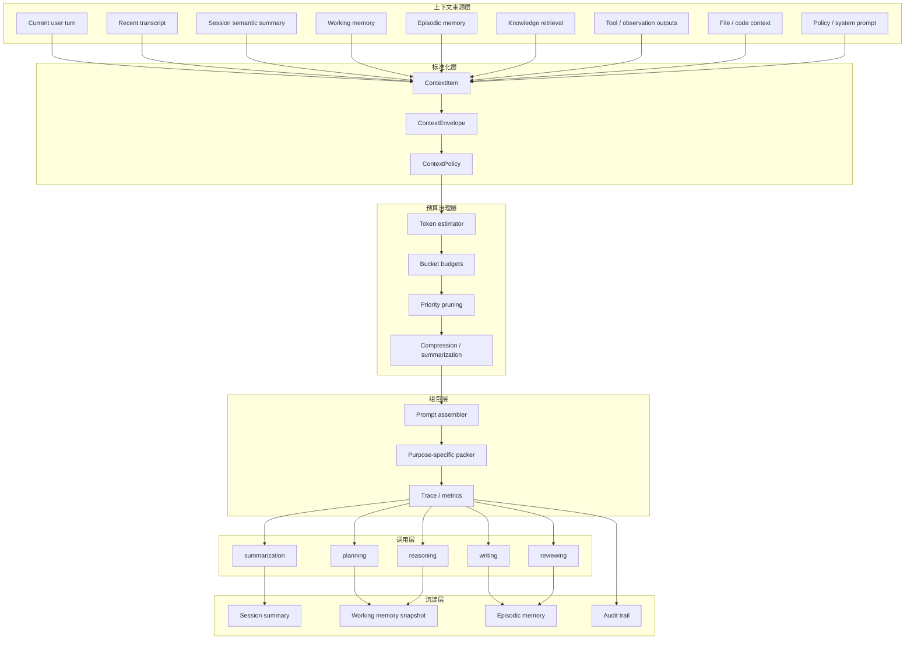

# ADR：Context Governance — 唯一长期上下文治理架构

> **状态：已采用（ADR §13 DoD 已验收）** · 版本：1.2 · 2026-06-04  
> 实现说明：[`CONTEXT_GOVERNANCE.md`](CONTEXT_GOVERNANCE.md)  
> 关联：[`README.md`](../README.md)、[`CAPABILITY_MATRIX.md`](CAPABILITY_MATRIX.md)、[`IMPLEMENTATION_STATUS.md`](IMPLEMENTATION_STATUS.md)、[`SESSION_TURN_POLICY.md`](SESSION_TURN_POLICY.md)、[`ADR_MISSION_LIFECYCLE_V2.md`](ADR_MISSION_LIFECYCLE_V2.md)

---

## 0. 北极星（一句话）

**任何一次 LLM 调用都不再直接“吃原始全量历史”，而必须经过统一 Context Governance 层：按上下文类型分层、按 token 预算组包、按优先级取舍、按长期记忆沉淀，并在全 runtime 中成为唯一上下文入口。**

这不是“给现有 history trim 再加一点补丁”，而是把当前散落在 [`conversation_context.py`](../app/services/conversation_context.py:1)、[`context_compressor.py`](../app/services/context_compressor.py:1)、[`memory_store.py`](../app/services/memory_store.py:271)、[`resource_budget.py`](../app/services/resource_budget.py:1) 的能力收束为**唯一长期架构**。

---

## 1. ADR 结论

### 1.1 最终判断

本项目必须采用**统一上下文治理层**，并将其视为与 mission orchestration、RAG、bounded ReAct 同级别的基础设施，而不是可选优化。

长期只维护这一套模式：

1. **所有 prompt 输入都由统一组包器生成**，禁止节点直接手拼 `conversation_history + prompt + retrieval`。
2. **所有上下文都必须先归类，再进入预算分配**；不允许无类型混装。
3. **所有长历史都必须经摘要 / 记忆化 / 检索化后再复用**；不允许把“更多原文历史”视为默认解法。
4. **所有资源控制以 token-aware 为准**；字符数裁剪只允许作为兜底策略，不再作为长期核心机制。
5. **所有上下文决策都必须可观测、可解释、可回放**；系统必须能回答“本轮为什么保留这些、丢弃那些”。
6. **Web / CLI 必须提供面向用户与开发者的上下文窗口可观测能力**，并支持系统自动压缩与受治理的手动压缩入口。（Web：`/chat` 对话页内嵌「上下文治理」面板，见 [`CONTEXT_GOVERNANCE.md`](CONTEXT_GOVERNANCE.md) § Web UI。）

### 1.2 一句话原则

**Prompt 只承载“本轮必须知道的最小充分信息”；其余信息不是丢失，而是被转化为摘要、结构化 working memory、episodic memory 与 retrieval evidence，在需要时再召回。**

---

## 2. 为什么必须这样做

### 2.1 当前实现已经有基础，但仍是“分散能力”

当前代码库已经具备以下能力：

- [`compress_conversation_history()`](../app/services/conversation_context.py:71)：按轮次 / 字符做裁剪
- [`apply_semantic_context_compress()`](../app/services/context_compressor.py:181)：对旧历史做语义摘要并保留最近若干轮
- [`write_turn_memories()`](../app/services/conversation_context.py:304)：把 turn 写入长期记忆
- [`compress_episode_summary()`](../app/services/memory_compress.py:20)：对 episode summary 做压缩
- [`BudgetContext`](../app/services/resource_budget.py:24)：做 token/cost 预算跟踪

这些能力证明方向是对的，但它们还没有形成统一的上下文治理系统。当前主要问题不是“完全没有压缩”，而是：

1. **上下文来源分散**：会话历史、memory、retrieval、plan、mission、tool output 尚未统一编排。
2. **裁剪主尺度仍偏字符级**：对真实模型窗口、不同 provider、不同 purpose 不够精确。
3. **缺少上下文优先级制度**：谁必须保留、谁可摘要、谁可丢弃，尚未形成统一规则。
4. **缺少节点级上下文合同**：planning、reasoning、writing、reviewing 需要的上下文结构不同，目前未由统一协议表达。
5. **缺少完整可观测性**：虽然已有部分 metrics，但尚不能稳定重建“本轮 prompt 是如何拼出来的”。

### 2.2 长期目标决定它必须成为一级基础设施

本项目不是单轮问答器，而是在向以下能力演进：

- 多轮 session agent
- mission / OMAW 编排型 agent
- 带 memory / retrieval / tool 的长程 runtime
- 潜在的 IDE / code-agent 类任务

这类系统最怕的不是“模型不够强”，而是**上下文治理失控**。一旦没有统一治理层，会持续出现：

- 关键约束被旧历史淹没
- prompt 长而散，信息密度低
- 不同节点携带重复上下文，成本失控
- 同一事实在 transcript、memory、tool output 中多次重复
- 代码诊断、日志、文件 diff 与聊天历史混杂，模型抓不住重点
- 预算耗尽时只能硬截断，缺少优雅降级

因此，长期标准下，Context Governance 必须与 [`ADR_MISSION_LIFECYCLE_V2.md`](ADR_MISSION_LIFECYCLE_V2.md) 中的 OMAW 一样，被提升为“唯一长期架构”。

---

## 3. 架构总图（唯一）



---

## 4. 铁律

1. **任何 LLM 调用只能消费 `ContextEnvelope`，不能直接消费裸 `conversation_history`。**
2. **上下文必须先分类后组包**；上下文项至少要声明 `kind`、`source`、`priority`、`cost`、`freshness`。
3. **摘要永远替代“远处原文重放”**；原始长历史不是长期主路径。
4. **working memory 与 transcript 必须分离**；计划、约束、tool outcomes 不得仅靠聊天文本隐式承载。
5. **episodic memory 与 retrieval evidence 必须可追溯来源**；模型不能拿到“无出处事实”。
6. **不同 purpose 必须有不同上下文合同**；planning、reasoning、writing、reviewing 不共享同一个 prompt 装配模板。
7. **token 预算必须先于模型调用被确定**；不能调用后再解释超长。
8. **任何裁剪都必须记录理由**；系统必须能回放 `kept/dropped/compressed`。
9. **字符级裁剪只作为 fail-safe**；长期实现必须以 token-aware 为核心。
10. **Context Governance 必须独立于单一任务类型存在**；QA、mission、code-agent、writing 均共用同一底座，只在 policy 层分化。
11. **用户界面可以暴露上下文状态，但不能把压缩权完全交给用户自由控制**；手动压缩只能作为受策略约束的显式操作。

---

## 5. 唯一词汇表

### 5.1 [`ContextItem`](../app/services/context_compressor.py:139)

最小上下文单元，代表一个可预算、可排序、可裁剪的上下文对象。

建议字段：

```json
{
  "id": "ctx_123",
  "kind": "system|user_turn|recent_history|semantic_summary|working_memory|episodic_memory|knowledge|tool_output|file_slice|diagnostic",
  "source": "session|memory|retrieval|tool|workspace|policy",
  "role": "system|user|assistant|tool",
  "content": "...",
  "priority": "critical|high|medium|low",
  "freshness": 0.92,
  "estimated_tokens": 320,
  "compressible": true,
  "droppable": false,
  "meta": {}
}
```

### 5.2 `ContextBucket`

同类上下文的预算桶，例如：

- `system_policy`
- `current_turn`
- `recent_transcript`
- `semantic_summary`
- `working_memory`
- `retrieved_memory`
- `retrieved_knowledge`
- `tool_observations`
- `file_context`
- `diagnostics`

### 5.3 `ContextEnvelope`

单次调用最终拿到的标准化上下文对象，是**唯一允许传给 LLM client 的结构**。

它至少应包含：

- `purpose`
- `model_name`
- `token_budget_total`
- `bucket_allocations`
- `items_kept`
- `items_compressed`
- `items_dropped`
- `rendered_messages`
- `trace`

### 5.4 `WorkingMemory`

本轮和近几轮执行态的结构化状态，长期必须与 transcript 分离。典型包含：

- goal
- hard_constraints
- current_plan
- executed_actions
- tool_outcomes
- pending_todos
- open_risks
- current_target_files
- active_diagnostics

当前 [`SemanticContextSummary`](../app/services/context_compressor.py:28) 已经在表达其中一部分，但长期应升级为独立模型，而不是仅作为摘要文案来源。

### 5.5 `EpisodicMemory`

已完成或阶段完成的结构化记忆。当前 [`write_structured_episode()`](../app/services/memory_store.py:271) 是雏形；长期要求它成为“可召回事实层”，不是简单文本归档。

### 5.6 `PromptContextPolicy`

按 `purpose` 和 `task_kind` 决定：

- 哪些 bucket 必须出现
- 每个 bucket 的 token 预算上限/下限
- 哪些 bucket 可压缩
- 哪些 bucket 可丢弃
- 哪些 bucket 必须保真保留原文
- 当预算不足时的降级顺序
- 是否允许用户触发手动压缩，以及允许的压缩作用域

---

## 6. 分层模型

### 6.1 L0：System / Policy Context

永远最小、稳定、强约束。包括：

- system prompt
- safety / governance policy
- worker capability contract
- output contract

特点：
- 默认不可压缩
- 默认不可丢弃
- token 预算固定且受硬顶限制

### 6.2 L1：Current Turn Context

只包含当前用户请求及本轮必要补充。

特点：
- 最高优先级
- 不允许摘要替代用户原意
- 可做轻量结构化（例如 intent extraction），但原文仍需保留

### 6.3 L2：Recent Transcript

最近若干轮原始对话。

特点：
- 用于保持对话连贯性
- 只保留最近窗口
- 一旦超过 budget，优先向 L3 语义摘要迁移

### 6.4 L3：Session Semantic Summary

旧轮次的语义摘要，不保留全部原文，只保留：

- 当前目标
- 硬约束
- 已执行结论
- 未完成事项
- 风险 / 冲突

长期上，它不只是 [`to_system_message()`](../app/services/context_compressor.py:37) 生成的一段文本，还应具备结构化字段与来源版本号。

### 6.5 L4：Working Memory

运行态上下文，不等于聊天记录。典型包括：

- 当前 `plan`
- `turn_facts`
- mission 状态
- 当前 chapter / file / cursor
- tool 结果摘要
- diagnostics

这层是 IDE agent 和长程 agent 稳定性的核心。

### 6.6 L5：Retrieved Episodic Memory

从长期记忆中按相关性召回，而不是全量塞入。

长期要求：
- 按 task/session/user/domain 检索
- 召回结果要有 relevance 与 provenance
- 召回后仍要再过 bucket budget 和去重

### 6.7 L6：Knowledge / Evidence

外部知识、知识库、文档 chunk、story bible、代码符号切片等。

特点：
- 必须带来源
- 禁止未经筛选的大段灌入
- 同类证据需要去重与 rerank

### 6.8 L7：Tool / Observation / Diagnostic Context

终端输出、编译报错、测试失败、文件 diff、runtime observation。

对 code-agent / debug 场景，这层经常比聊天历史更重要，因此应具备独立高优先级桶，而不是附庸在 transcript 中。

---

## 7. 唯一执行路径

### 7.1 总流程

任何一次模型调用都必须走以下流水线：

1. **Collect**：从 session、state、memory、retrieval、tool、workspace 收集原始上下文
2. **Normalize**：全部转为 `ContextItem`
3. **Classify**：归入 `ContextBucket`
4. **Estimate**：估算 token 成本
5. **Allocate**：按 `PromptContextPolicy` 分配各桶预算
6. **Prune**：按优先级、相关性、保真要求做裁剪
7. **Compress**：对允许压缩的桶做语义摘要 / 去重 / 合并
8. **Assemble**：渲染为 provider-neutral messages
9. **Trace**：记录每个保留/压缩/丢弃动作
10. **Invoke**：调用模型
11. **Persist**：把新的摘要、working memory、episodic memory、trace 写回

### 7.2 禁止的旧路径

长期必须废止下列模式：

- 业务节点直接读取 [`conversation_history_from_state()`](../app/services/conversation_context.py:129) 后自行拼 prompt
- retrieval 节点把结果原样附加到 prompt 而不进入统一预算治理
- tool 输出直接混入 transcript 供后续轮次消费
- 各节点自行决定裁剪逻辑，导致策略分叉

---

## 8. purpose-specific policy

### 8.1 planning

目标：尽快理解意图、限制与可行下一步，而不是吃全量细节。

必须包含：
- system / policy
- current turn
- semantic summary
- working memory
- 少量 recent transcript
- 如有必要的 memory hits

默认弱化：
- 大段知识片段
- 大段 tool logs
- 长文件正文

### 8.2 reasoning

目标：给出当前回合答案或战术决策。

必须包含：
- system / policy
- current turn
- recent transcript
- semantic summary
- working memory
- 相关 memory / knowledge

可选增强：
- tool observation
- diagnostic snippets

### 8.3 writing / review

目标：生产或评审长文本。

必须包含：
- worker contract
- current work item
- working memory
- chapter/file scope context
- evidence / fact bundles
- 必要的 recent transcript 与 semantic summary

默认禁止：
- 与当前章/当前 work item 无关的长会话原文
- 无来源的“凭印象事实”

### 8.4 summarization / compression

目标：为未来调用制造高密度信息对象。

必须输入：
- 原始待压缩对象
- 当前 goal / constraints
- 保真规则
- 结构化输出 schema

其输出必须是结构化对象，不应只有自然语言段落。

---

## 9. 与现有代码的对应改造

### 9.1 保留并收编的能力

以下现有能力应保留，但纳入统一 Context Governance 层：

- [`compress_conversation_history()`](../app/services/conversation_context.py:71) → 变为 transcript bucket 的 fail-safe trim
- [`compress_session_history()`](../app/services/conversation_context.py:111) → 变为 session summary 生成的一部分
- [`apply_semantic_context_compress()`](../app/services/context_compressor.py:181) → 变为 L2→L3 转换器
- [`record_context_compress_metrics()`](../app/services/context_compressor.py:67) → 变为 governance metrics 子集
- [`write_turn_memories()`](../app/services/conversation_context.py:304) → 变为 persist 阶段的一部分
- [`write_structured_episode()`](../app/services/memory_store.py:271) → 变为 episodic memory sink
- [`create_session_summary()`](../app/services/memory_store.py:341) → 变为 session summary sink
- [`BudgetContext`](../app/services/resource_budget.py:24) → 升级为 token/cost budget 的外层治理器

### 9.2 必须新增的核心模块

建议长期固定为以下模块边界：

- `app/services/context_items.py`：定义 `ContextItem` / `ContextEnvelope` / `ContextBucket`
- `app/services/context_policy.py`：定义 `PromptContextPolicy`
- `app/services/context_estimator.py`：provider/model-aware token estimator
- `app/services/context_reducer.py`：去重、裁剪、压缩、合并
- `app/services/context_assembler.py`：唯一组包入口
- `app/services/context_trace.py`：记录 kept/compressed/dropped trace
- `app/services/working_memory.py`：结构化 working memory 的读写与快照
- `app/services/prompt_context_gateway.py`：供 planning/reasoning/writing 等节点统一调用

### 9.3 必须调整的调用关系

长期必须做到：

- [`planning_node.py`](../app/nodes/planning_node.py:33) 不再直接依赖原始 `conversation_history`
- [`reasoning_trace.py`](../app/services/reasoning_trace.py:382) 不再自行截取历史，而是消费 `ContextEnvelope.trace`
- retrieval / tool / observation 结果在进入下轮前必须先标准化为 `ContextItem`
- mission / OMAW worker 的输入上下文必须经 `PromptContextPolicy(purpose=writing|reviewing)` 组包

---

## 10. 长期标准下的代码代理专项要求

如果本 runtime 继续向 IDE / code-agent 演进，必须把代码上下文视为一级公民，而不是知识检索的附属品。

### 10.1 新的上下文类型

至少新增：

- `file_slice`
- `symbol_slice`
- `git_diff`
- `diagnostic`
- `test_failure`
- `terminal_output`
- `workspace_summary`

### 10.2 代码场景的优先级规则

默认优先级应接近：

1. 当前用户请求
2. diagnostics / compile errors / failing tests
3. edited diff
4. current target file slice
5. relevant symbol definitions
6. working memory
7. recent transcript
8. semantic summary
9. episodic memory
10. general knowledge

### 10.3 大文件策略

长期禁止把整个大文件原文直接放进 prompt。必须走：

- symbol 索引
- 局部切片
- 摘要 + on-demand expansion
- 修改区域邻近窗口

这部分才是 Cursor / Copilot / Claude Code 这类 IDE agent 真正有价值的“上下文压缩”。

---

## 11. 观测与审计

Context Governance 不是“黑盒压缩器”，而必须是可审计系统。

### 11.1 每次调用至少记录

- `purpose`
- `model`
- `token_budget_total`
- 各 bucket 初始 token
- 各 bucket 最终 token
- `kept_count`
- `compressed_count`
- `dropped_count`
- 每个 drop/compress 的 reason
- 最终 messages token estimate
- 调用结果质量标签（若有）

### 11.2 核心指标

建议长期固定以下指标：

- `context_bucket_tokens{purpose,bucket}`
- `context_drop_total{purpose,bucket,reason}`
- `context_compress_total{purpose,bucket,method}`
- `context_recall_total{source}`
- `context_assembly_latency_ms{purpose}`
- `context_overflow_prevented_total{purpose}`
- `context_quality_regression_total{purpose}`

### 11.3 Debug 可视化

需要提供面向开发者的“prompt composition view”，至少展示：

- 本轮有哪些 bucket
- 每桶拿了哪些 item
- 哪些被压缩/丢弃
- 最终渲染后的 message 结构

没有这层可视化，后续所有质量问题都会退化为“猜 prompt 为什么变坏”。

---

## 12. 迁移原则

长期标准下，迁移必须遵守以下原则：

1. **先统一入口，再逐节点替换**；不能一边新增组包器，一边允许旧节点继续各自拼装。
2. **先定义对象模型，再替换压缩逻辑**；没有 `ContextItem` 与 `PromptContextPolicy`，就不会有稳定治理。
3. **先确立审计与指标，再扩大默认启用范围**；否则无法判断压缩是否伤害质量。
4. **先把 working memory 独立出来，再讨论更复杂的摘要策略**；否则摘要永远在替代错误的东西。
5. **先 token-aware，再谈多模型最优编排**；字符截断不够支撑长期演进。

---

## 13. 验收标准（长期唯一 DoD）

以下标准全部达成，才算 Context Governance 长期架构落地：

### 13.1 架构层

- 所有 LLM 调用都经由单一 `prompt_context_gateway`
- 代码库中不存在新的“手拼上下文”主路径
- `conversation_history` 不再作为直接 prompt 输入，而只作为 transcript source

### 13.2 语义层

- transcript、working memory、episodic memory、knowledge、tool output 五类上下文边界清晰
- 每种 `purpose` 都有显式 `PromptContextPolicy`
- 远历史默认以 semantic summary / episodic memory 形式存在，而不是原文回放

### 13.3 资源层

- 所有预算治理以 token-aware 为主
- 字符级 trim 仅为 fail-safe
- 预算不足时存在确定性的降级顺序，而不是随机截断

### 13.4 观测层

- 每次调用可追踪上下文来源、取舍与压缩动作
- 核心指标可用于判断上下文质量回归
- 开发者可查看 prompt composition debug view

### 13.5 质量层

- 长 session 下答案一致性优于当前基线
- mission / writing / code-agent 场景的上下文污染率下降
- 平均 prompt token 成本下降或在同成本下质量上升
- “关键信息因裁剪丢失”成为可定位、可归因、可修复的问题，而非黑盒故障

---

## 14. 最终决议

本项目关于“上下文压缩 / 上下文上限”的长期答案，不是继续堆叠更多 trim 逻辑，而是：

**建立唯一 Context Governance 架构，把上下文从“会话历史”升级为“多来源、分层、可预算、可审计的运行时资产”。**

在这个架构下：

- [`conversation_context.py`](../app/services/conversation_context.py:1) 负责 transcript 生命周期，而不再承担全部上下文治理
- [`context_compressor.py`](../app/services/context_compressor.py:1) 负责压缩策略，而不再是分散调用的工具函数集合
- [`memory_store.py`](../app/services/memory_store.py:271) 负责记忆沉淀与召回，而不再只是存储端
- [`resource_budget.py`](../app/services/resource_budget.py:1) 负责成本预算，而必须与 prompt token 预算统一

长期只维护这一个方向，不再引入第二套并行的 prompt 拼装模型。