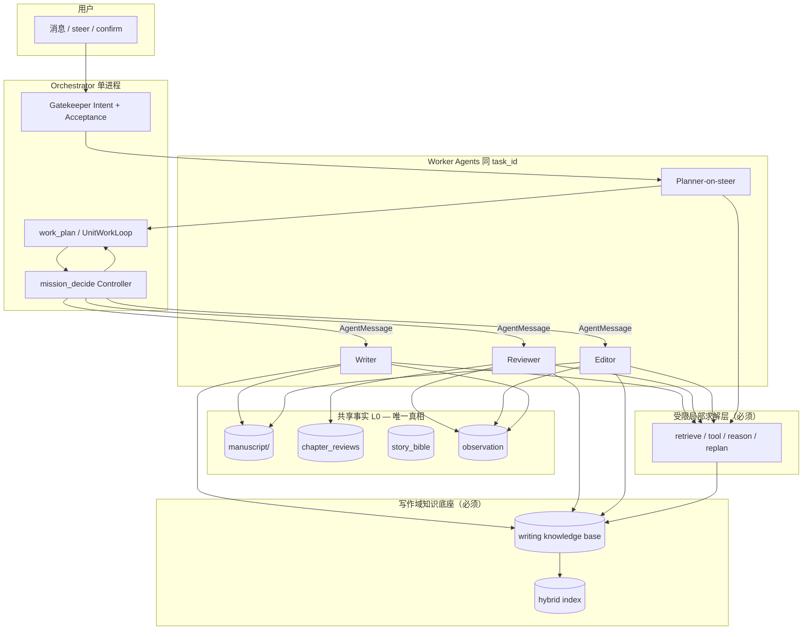

# ADR-001：Mission OMAW — 唯一长期写作架构

> **状态：已采纳（唯一方案）** · 版本：1.2 · 2026-06-03  
> 取代：单图 `planning→reasoning` 执行写作、与 mission 脱钩的 Supervisor 多 Agent 模式并列试探。  
> 关联：[`ADR_TURN_KIND.md`](ADR_TURN_KIND.md)、[`MANUSCRIPT_WRITING.md`](MANUSCRIPT_WRITING.md)、[`MISSION_EXECUTION_CONTROL.md`](MISSION_EXECUTION_CONTROL.md)

---

## 0. 北极星（一句话）

**一任务、一手稿事实库、一编排器（Orchestrator）、多角色 Worker（Writer / Reviewer / Editor / Planner）通过 A2A 消息协作；用户 steer 只改 `IntentSpec` 与 `work_plan`，事实补全统一通过 RAG + bounded ReAct 进入，合格性只由 `ReviewVerdict` 表达。**

长期只维护这一套运行时：**`execution_mode = mission_oma`**（Orchestrated Multi-Agent Writing）。  
不再新增「第三种跑法」；`single` 仅服务无 mission 的 QA，`supervisor` 仅服务非手稿通用多域任务。

---

## 1. ADR 结论

### 1.1 最终判断：**必须引入 ReAct，且必须引入写作域 RAG，但两者都不作为 Mission 主环**

本 ADR 的执行要求分三层：

1. **必须引入 ReAct**，因为写作 runtime 存在局部探索、工具调用、失败恢复、局部重规划等刚性需求。现有代码中已经有完整的有界 ReAct 能力，如 [`ReactLoopState`](app/domain/react_loop.py:144)、[`route_after_react_observe()`](app/runtime/react_router.py:35)、[`execute_bounded_action()`](app/services/react_loop_runner.py:349)。
2. **必须引入写作域 RAG**，因为长篇写作需要稳定调用外部事实和项目知识，而不能只依赖上下文窗口或 episodic memory。现有实现已经具备写作域检索基础，例如 [`retrieval_domains_for_state()`](app/services/retrieval_policy.py:61) 已将 writing 任务路由到 `{"writing", "common"}`，[`KnowledgeStore.upsert_document()`](app/services/knowledge_store.py:425) 已支持分块、嵌入与混合检索。
3. **必须禁止 ReAct 或 RAG 升格为 OMAW 主执行骨架**。长篇写作的主语义是「编排、派单、验收、续写」，而不是「先开放式检索/思考，再决定做什么」。现有 [`build_mission_graph()`](app/runtime/mission_graph.py:43) 已经是明确的 `decide → act → observe → eval` 控制环；文档要求保持其确定性、可审计性与角色隔离。

### 1.2 一句话原则

**OMAW 决定“谁来做、做到什么算过”；RAG 决定“可引用的外部事实从哪里来”；ReAct 决定“Worker 在受限边界内如何拿事实、调工具、局部重试”；[`Context Governance`](ADR_CONTEXT_GOVERNANCE.md) 决定“每一次 planning / reasoning / writing / reviewing 到底允许看到哪些上下文、以什么预算和保真度进入 prompt”。**

---

## 2. 为何必须多 Agent（且你们其实还没完全用上）

| 现状 | 问题 |
|------|------|
| 长篇 mission 只有 **一个控制循环**，`writing_phase` 在单进程里切换 | 审阅、润色、写作共用同一 narrator/planning 上下文，易串戏 |
| `task_type=supervisor` + A2A **存在但未接入手稿** | 多 Agent 能力闲置；写作仍走 `mission_act` 内联节点 |
| 规划 / 推理 / 执行 混在主图 | debug 中会出现「计划 review、实际 reasoning 读文件」 |
| 已有 ReAct 子图，但与 handoff/worker 契约没有稳定边界 | 若直接接到主写作链路，容易重回“谁都能推理、谁都能执行”的漂移状态 |
| 已有知识检索能力，但未被定义为写作固定基础设施 | 写作时外部设定、资料、世界观、体裁规则无法稳定复用 |

**结论**：需要的不是「更多模式的菜单」，而是 **把 `writing_phase` 升格为固定角色 Worker Agent**，由 Orchestrator 派单，共享 `task_id` 手稿目录与 `chapter_reviews.json`；同时把 **RAG 固化为写作事实底座**，把 **ReAct 固化为受边界约束的执行子程序**。

---

## 3. 架构总图（唯一）



### 3.1 铁律

1. Worker **只写自己 capability 允许的 artifact**；禁止跨角色改大纲（除非 Editor 契约允许）。
2. Orchestrator **不产生正文副作用**；只派单、验收、发 grant。
3. **`ReviewVerdict`** 为合格唯一语义；composite 阈值仅为默认路由参数。
4. 主图 **永不** 以 `reasoning` 代替 Reviewer/Writer 执行。
5. ReAct **不能直接改写手稿事实库**；其输出必须先回到 Worker，再由 Worker 按 capability 落盘。
6. RAG **只提供证据与上下文，不直接产出正文定稿**；所有正文与 verdict 仍由对应 Worker 负责。
7. ReAct **必须有界**：白名单动作、最大步数、失败上限、明确退出路径，遵循现有 [`ReactLoopState.max_steps`](app/domain/react_loop.py:149)、[`should_abort_loop()`](app/services/react_loop_runner.py:458)、[`finalize_loop()`](app/services/react_loop_runner.py:478) 的设计。
8. 写作域 RAG **必须分层**：世界观/设定、角色卡、章节事实、用户约束、外部资料分开建索引，禁止把整部手稿无区分丢进一个桶里检索。

---

## 4. 角色定义（固定四类 + 可扩展质量角色）

| Agent ID | 能力 capability | 对应现有实现 | 输入上下文 | 输出 |
|----------|-----------------|--------------|------------|------|
| `writer` | `write_chapter` | `writing_node` + append_body | outline 切片、novel_tail、bible、RAG facts | 正文 delta、chapter cursor |
| `reviewer` | `review_chapter` | `writing_phases.review_chapter` + `writing_quality` | 本章片段、上文、outline、bible、RAG facts | **`ReviewVerdict`** |
| `editor` | `polish_chapter` | `writing_phases.polish_chapter` | verdict + 本章文本 + RAG facts | patch delta、re-verdict 触发 |
| `planner` | `steer_replan` | `planning_node`（仅 steer） | `IntentSpec`、`work_plan`、失败摘要 | `work_plan_patch`、`TurnEnvelope` |
| `continuity` | `consistency_check` | continuity / consistency phase | bible + 多章摘要 + chapter facts | issues list |

**不是** 每章一个自由对话 Agent，而是 **能力受限的 Worker**，由编排器按 `work_plan` 调度。

### 4.1 与 `writing_phase` 的关系

- **废弃**「一个 LLM 在 `mission_decide` 里自选 phase」作为默认路径（`writing_llm_decide` 默认改为 **false**）。
- **改为** Orchestrator 根据 `work_plan` 头项 + `ReviewVerdict` **机械派** `to_agent`。
- `writing_phase` 字段保留为 **Worker payload 别名**，便于迁移。

### 4.2 与 Supervisor/A2A 的关系

- 复用：`AgentMessage`、`dispatch_message` / `run_subtasks_via_a2a`（`app/services/a2a_dispatch.py`）。
- **绑定**：`parent_task_id` = 手稿 task；`context` 必含 `manuscript_paths`、`chapter_index`。
- **禁止**：supervisor 通用 decompose 在无 `manuscript` 绑定时作用于写作 mission。

### 4.3 与 ReAct 的关系

- ReAct 不是第五个常驻主角色，而是 **Writer/Reviewer/Editor/Planner 的统一内建执行能力**。
- ReAct 是否执行由 `WorkerExecutionPolicy` 与当前工作项决定，不由开放式 prompt 自由决定。
- `planner` 允许 `replan`；`reviewer` 允许 `retrieve_knowledge` / `retrieve_memory` / `reason`；`writer` 允许 `retrieve_knowledge` / `call_tool` / `reason`；`editor` 允许受限事实补全与 reason，不允许开放式连续 replan。

### 4.4 与 RAG 的关系

- RAG 是写作 Worker 的标准输入层，不是附加增强。
- `writer` 在开章、续写、补桥段前必须拿到 chapter scope 的事实包。
- `reviewer` 在出 verdict 前必须检查是否取得 outline / bible / chapter facts / user constraints 的检索证据。
- `editor` 在修补设定或风格问题时必须读取对应证据，避免“凭印象改文”。

---

## 5. 核心领域对象（全栈唯一词汇表）

### 5.1 `IntentSpec`（用户意图规格）

```json
{
  "kind": "batch_review | continue_write | edit_plot | pause | side_qa",
  "scope": { "chapters": [1, 30], "mode": "score_and_fix" },
  "coverage": "selective | user_scope | below_verdict",
  "acceptance": {
    "all_in_scope_reviewed": true,
    "failed_must_polish_or_human": true,
    "emphasis_dimensions": ["outline_alignment", "continuity_score"]
  }
}
```

- 仅 **`planner` Worker** 在 steer 时写入；Orchestrator 持久化到 `input_payload.intent_spec`。

### 5.2 `UnitWorkLoop`（战略展开）

配置驱动（`mission.unit_loop: chapter_unit`）：

```text
retrieve facts → write → review → (polish if verdict.polish_recommended) → gate → continue write
```

- 展开为 `work_plan.items`（非 LLM 散文 plan）。
- batch 审阅：展开 N 个 `review` 项，但 **Intent Gate 只确认策略**（章范围、模式），不按 prepend 行数触发。
- 任何 `write_chapter` / `review_chapter` / `polish_chapter` 工作项都必须显式带出对应 `fact_bundle_id`。

### 5.3 `ReviewVerdict`（合格语义）

```json
{
  "chapter_index": 1,
  "qualified": true,
  "model_pass": true,
  "rubric": { "...": "ChapterQualityRubric" },
  "issues": [],
  "polish_recommended": false,
  "evidence": {
    "outline_slice": true,
    "prev_chapter": true,
    "rag_used": true,
    "react_steps": 2
  }
}
```

- 仅 **`reviewer` Worker** 写入 `chapter_reviews.json`。
- `qualified` := `model_pass` ∧ 无 blocking issues（**不是** composite≥0.65）。
- `evidence` 必须记录 reviewer 是否经过事实补全，例如：`knowledge_used`、`memory_used`、`tools_used`、`react_steps`、`fact_bundle_id`。

### 5.4 `TurnEnvelope`（单 tick 战术）

```json
{
  "turn_kind": "steer_execute | mission_step_execute | mechanical_continue",
  "contract": { "primary_op": "batch_unit_quality" },
  "work_item_id": "wi-batch-review-3",
  "dispatch": { "to_agent": "reviewer", "capability": "review_chapter" }
}
```

### 5.5 `WorkerExecutionPolicy`（必须落地）

```json
{
  "agent": "reviewer",
  "capability": "review_chapter",
  "retrieval": {
    "required": true,
    "domains": ["writing", "common"],
    "must_include": ["outline", "story_bible", "chapter_summary", "user_constraints"]
  },
  "react": {
    "enabled": true,
    "max_steps": 3,
    "allowed_actions": ["retrieve_knowledge", "retrieve_memory", "reason", "finish"],
    "exit_paths": ["finish_with_answer", "reflection", "dead_letter"]
  },
  "tool_budget": {
    "max_calls": 2,
    "allowed_tools": ["read_text_artifact", "grep_file"]
  }
}
```

该对象用于把「角色能力」映射到「RAG 必要性、ReAct 白名单、工具预算、落盘权限」，是 OMAW 的必备执行契约。

### 5.6 `FactBundle`（新增，必须引入）

```json
{
  "fact_bundle_id": "fb-ch12-review-001",
  "task_id": "task-123",
  "chapter_index": 12,
  "capability": "review_chapter",
  "sources": [
    { "type": "outline", "ref": "outline/ch12" },
    { "type": "story_bible", "ref": "bible/roles/protagonist" },
    { "type": "chapter_summary", "ref": "summary/ch11" },
    { "type": "knowledge_hit", "ref": "doc_abc__c0003" }
  ],
  "evidence_text": "...",
  "built_at": "2026-06-03T07:00:00Z"
}
```

`FactBundle` 是 Worker 的直接输入，而不是让每个 Worker 现场去猜该读哪些资料。RAG 的结果必须先被归并成 bundle，再进入 capability 执行。

---

## 6. 写作域 RAG：必须纳入正式架构

### 6.1 为什么写作必须使用 RAG

长篇写作不是普通 QA，至少存在四类无法仅靠上下文窗口稳定维持的信息：

1. **长期世界观事实**：设定、规则、历史、派系、地图、能力体系。
2. **角色一致性事实**：人物关系、口头禅、禁忌、目标、成长弧线。
3. **章节邻接事实**：上一章摘要、未回收伏笔、当前章约束、章节目标。
4. **用户硬约束**：禁写项、风格要求、篇幅要求、必须保留的剧情条件。

只靠 prompt 堆叠会导致：

- 长任务上下文爆炸；
- 设定漂移；
- reviewer 无法给出可追溯 verdict；
- editor 修文凭印象而不是凭证据。

因此，**RAG 不是增强项，而是 OMAW 的事实供应层。**

### 6.2 与现有实现的对应关系

当前代码已经具备可复用基础：

- [`retrieval_domains_for_state()`](app/services/retrieval_policy.py:61) 已支持 writing 域与 common 域检索。
- [`retrieval_node()`](app/nodes/retrieval_node.py:23) 已支持知识检索 + memory 检索。
- [`KnowledgeStore.upsert_document()`](app/services/knowledge_store.py:425) 已支持 chunk、embedding、向量索引。
- [`build_turn_facts()`](app/services/fact_layer.py:46) 已经有“本轮事实层”概念，适合承接 `fact_bundle` 的审计投影。

但当前缺口是：**这些能力尚未被定义为写作 Worker 的强制输入协议**。

### 6.3 RAG 分层模型（必须）

写作域知识库必须至少分成以下类型：

| 层级 | 内容 | 更新频率 | 典型用途 |
|------|------|----------|----------|
| `project_rules` | 用户硬约束、风格令、禁写规则 | 低 | 所有 Worker |
| `story_bible` | 世界观、角色卡、设定、时间线 | 中 | writer / reviewer / editor |
| `outline` | 卷/章/场景规划 | 中 | writer / planner / reviewer |
| `chapter_facts` | 章节摘要、已发生事件、伏笔状态、角色状态 | 高 | writer / reviewer / continuity |
| `external_reference` | 资料文档、历史/专业背景、体裁范式 | 中 | writer / reviewer |

### 6.4 RAG 检索规则（必须）

1. `writer.write_chapter`：必须检索 `project_rules + story_bible + outline + 邻接章节 facts`。
2. `reviewer.review_chapter`：必须检索 `project_rules + story_bible + outline + 当前章/前章 facts`。
3. `editor.polish_chapter`：必须检索 `review_verdict.evidence` 对应来源与当前章 facts。
4. `planner.steer_replan`：必须检索 `IntentSpec + 失败工作项 + 相关 outline/facts`。
5. `continuity.consistency_check`：必须跨多章 facts 与 story_bible 做聚合检索。

### 6.5 RAG 与 Memory 的边界

- `memory_hits` 只解决会话承接，不替代写作事实库。
- 写作中的关键长期事实必须入 `KnowledgeStore`，不能只存在 session memory。
- 对写作任务，memory 是补充层，RAG 是主事实层。
- 这与 [`should_skip_session_memory_retrieval()`](app/services/retrieval_policy.py:40) 的设计方向一致：首轮写作不应依赖 episode memory 生成正文。

### 6.6 RAG 与手稿正文的边界

- 手稿正文本身不直接作为通用知识源全文检索，避免把尚未定稿的噪音内容回灌成“事实”。
- 正文应先经章节摘要/结构化抽取，沉淀为 `chapter_facts`，再参与检索。
- 如需检索正文片段，应仅限当前章或相邻章的受限范围读取，不走全局无差别向量召回。

---

## 7. 运行时：唯一管道 Mission OMAW

### 7.1 图拓扑

```text
session_turn → mission_graph ONLY
  mission_init
  → loop:
      mission_decide (Orchestrator)
      → mission_act:
           if turn_kind == steer_replan → planner Worker
           → build FactBundle
           → dispatch AgentMessage → writer | reviewer | editor | continuity
      → mission_observe
      → mission_eval
  → mission_finalize
```

这与现有 [`build_mission_graph()`](app/runtime/mission_graph.py:43) 的使命控制骨架一致，即 Mission 的主循环已经清晰稳定；应继续增强其编排职责，而不是把主循环改造成自由形态的 ReAct 或 retrieval 外环。

### 7.2 删除路径（重构完成标志）

- 主图 `planning → reasoning → COMPLETED` 处理 mission 执行。
- `run_pipeline_request` 作为 mission 默认执行器。
- 写作 mission 在未构造 `FactBundle` 时直接进入正文生成。

### 7.3 TurnKind（控制面，不变）

| TurnKind | 行为 |
|----------|------|
| `steer_replan` | 仅 `planner` Worker |
| `steer_execute` | Gate 通过后派 reviewer/editor/writer |
| `mission_step_execute` | 常态派单 |
| `mechanical_continue` | grant → writer append |
| `narrate_only` | 仅 QA 会话；不进 mission_graph |

### 7.4 RAG / ReAct 插入点（固定）

仅允许以下固定插入点：

1. **派单前 FactBundle 构造**：Orchestrator 或 worker bridge 根据 capability 先做强制检索。
2. **Worker 内部 bounded ReAct**：当事实不充分、工具未执行或首次失败时进入。
3. **Acceptance 失败后的 planner 窄重规划**：只对失败范围 replan。

明确禁止：

- Orchestrator 在 `mission_decide` 中进入开放式多轮 ReAct 后再决定派谁。
- ReAct 直接对 `manuscript/` 或 `chapter_reviews.json` 落盘。
- Writer 在正文创作过程中无限次边写边 ReAct。
- 写作 Worker 在没有 RAG 事实包时直接生成最终内容。

---

## 8. 用户旅程（唯一语义）

### 8.1 正常写作（无中断）

```text
Orchestrator → build FactBundle(ch N, writer)
            → writer (append ch N)
            → build FactBundle(ch N, reviewer)
            → reviewer
            → editor (if verdict.polish_recommended)
            → reviewer (re-review if needed)
            → build FactBundle(ch N+1, writer)
            → writer (append ch N+1)
```

### 8.2 中断（用户 steer）

```text
steer → IntentSpec
     → planner Worker
     → Intent Gate（策略确认）
     → build FactBundle(for failed scope)
     → steer_execute：派 reviewer/editor batch
     → Acceptance：机械对照 intent_spec.acceptance
     → 通过 → mechanical_continue → writer
     → 不通过 → planner 窄重规划（仅失败章）
```

### 8.3 局部失败恢复

```text
worker failed / evidence insufficient
  → enter bounded React
  → retrieve_knowledge / retrieve_memory / call_tool / reason / replan
  → rebuild FactBundle if needed
  → success → resume worker capability execution
  → still failed → reflection / human_review / dead_letter
```

这与现有 [`route_after_react_finalize()`](app/runtime/react_router.py:74) 的退出设计相符：ReAct 服务于局部恢复与回流，而不是接管主业务控制面。

---

## 9. 合格判定（回应“阈值难定”）

| 层级 | 谁判断 | 用什么 |
|------|--------|--------|
| **语义合格** | `reviewer` Worker（LLM） | 片段 + 章要求 + outline 切片 + 上文 + bible + fact bundle |
| **落盘** | `ReviewVerdict` | `qualified`, `issues`, `model_pass`, `evidence` |
| **路由** | Orchestrator（机械） | `polish_recommended`, `UnitWorkLoop.gates` |
| **配置阈值** | 默认策略 | `WRITING_QUALITY_GATE_THRESHOLD` 仅当 LLM 不可用 |
| **事实补全** | RAG + bounded ReAct | retrieval / memory / tools / intermediate reason |

**禁止**用 Orchestrator 或 Narrator 重新“猜一遍是否合格”。  
**也禁止**把 ReAct 的 `reason` 输出当成最终合格判定；最终判定仍必须产出标准化 `ReviewVerdict`。  
**没有 `evidence.fact_bundle_id` 的 `ReviewVerdict` 不算有效 verdict。**

---

## 10. 工程落点（补齐当前文档缺的细节）

### 10.1 模块映射（必须落地）

| 模块 | 职责 |
|------|------|
| `app/services/mission_oma/orchestrator.py` | decide + dispatch + acceptance |
| `app/services/mission_oma/workers.py` | writer/reviewer/editor/continuity 适配现有 nodes |
| `app/services/mission_oma/intent_spec.py` | `IntentSpec` 规范化 |
| `app/domain/review_verdict.py` | 合格类型 |
| `app/domain/worker_execution_policy.py` | 角色到 RAG / ReAct / 工具预算 / 落盘权限映射 |
| `app/domain/fact_bundle.py` | `FactBundle` 数据结构 |
| `app/services/fact_bundle_builder.py` | 构建 capability-aware 的事实包 |
| `app/services/worker_react_bridge.py` | Worker 调用 bounded ReAct 的统一桥接层 |
| `app/services/a2a_dispatch.py` | 并行 review（扩展 context 绑定） |
| `app/runtime/mission_graph.py` | 唯一入口 |
| `app/services/mission_executor.py` | 瘦身为 dispatch 层 |

### 10.2 统一桥接接口

必须增加统一接口，避免每个 Worker 各自拼装检索与 ReAct 状态：

```python
def build_fact_bundle(
    state: AgentState,
    *,
    agent: str,
    capability: str,
    chapter_index: int | None,
) -> dict[str, Any]:
    ...


def run_worker_bounded_react(
    state: AgentState,
    *,
    agent: str,
    capability: str,
    goal: str,
    allowed_actions: list[str],
    max_steps: int,
) -> AgentState:
    ...
```

要求：

1. 先 `build_fact_bundle(...)`，再进入 worker capability。
2. 若事实不足或执行失败，再 `run_worker_bounded_react(...)`。
3. ReAct 结束后必须重新归并 `fact_bundle`，避免“检索结果到了，但执行输入没刷新”。
4. 所有结果进入 observation / audit，不污染最终用户输出。
5. 严禁直接提交 artifact 写操作；如需要 patch，必须返回 Worker 再执行业务落盘。

### 10.3 状态边界

OMAW 必须显式区分五类状态：

1. **Mission State**：`mission_step`、`progress.work_plan`、`step_decision`。现状可参考 [`mission_decide_node()`](app/nodes/mission_decide_node.py:85) 与 [`apply_work_plan_to_payload()`](app/services/mission_orchestrator.py:396)。
2. **Worker Task State**：当前派单对象、当前章、当前 capability、输入 artifacts snapshot。
3. **RAG State**：检索 query、domains、命中结果、`fact_bundle_id`。
4. **ReAct Local State**：`react_loop`、中间 observation、工具结果、局部 reasoning。现状可参考 [`ReactLoopState`](app/domain/react_loop.py:144)。
5. **Artifact State**：`manuscript/`、`chapter_reviews.json`、`story_bible`、`observation`。

关键约束：**RAG State 和 ReAct Local State 都不能越级替代 Artifact State。**

### 10.4 审计与可观测性

当前代码已有 audit、turn facts、react event 基础；文档进一步要求：

- 每次 Worker 派单生成 `dispatch_id`。
- 每次 FactBundle 构造生成 `fact_bundle_id`。
- 每次 bounded ReAct 生成 `react_session_id`，挂在 `dispatch_id` 下。
- [`build_turn_facts()`](app/services/fact_layer.py:46) 的事实层必须扩展记录：
  - `fact_bundle_id`
  - `rag_hit_count`
  - `rag_domains`
  - `react_used`
  - `react_steps`
  - `tools_used`
  - `fallback_used`
- metrics 至少包含：
  - `mission_dispatch_total{agent, capability}`
  - `fact_bundle_build_total{agent, capability}`
  - `fact_bundle_hit_total{source_type}`
  - `worker_react_enter_total{agent, capability}`
  - `worker_react_abort_total{reason}`
  - `review_verdict_total{qualified}`
  - `acceptance_fail_total{reason}`

### 10.5 并发与锁

当 `IntentSpec.scope.chapters` 为多章且互不依赖：

```text
Orchestrator → run_subtasks_via_a2a(
  subtasks = [
    { to_agent: "reviewer", capability: "review_chapter", chapter_index: k },
    ...
  ],
  max_workers = MISSION_REVIEW_MAX_PARALLEL
)
```

- Reviewer 并行安全，因为每 Worker 写独立 `ReviewVerdict` 键。
- FactBundle 构造可以并行，但必须固定 snapshot 版本，避免同一批 reviewer 读到不同 outline 版本。
- Editor/Writer 涉及共享正文文件时必须串行，或引入章级锁。
- Worker 内 ReAct 的工具调用继承同一锁上下文，防止“正文串行但工具预读的是旧快照”。

### 10.6 失败语义与回退

工程上必须明确三层失败：

1. **Worker 业务失败**：如 reviewer 无法形成 verdict。
2. **ReAct 子程序失败**：如工具受阻、检索为空、达到 [`REACT_LOOP_MAX_FAILURES`](app/services/react_loop_runner.py:473) 或 [`REACT_LOOP_MAX_REPLAN`](app/services/react_loop_runner.py:463)。
3. **Mission 编排失败**：如 acceptance 无法满足、依赖项 blocked、dead letter。

强制回退顺序：

```text
worker try
  → bounded react retry
  → rebuild fact bundle
  → planner narrow replan
  → human_review / dead_letter
```

### 10.7 配置要求

```yaml
mission:
  execution_mode: mission_oma
  writing_llm_decide: false
  review_max_parallel: 3
  unit_loop: chapter_unit
  worker_retrieval:
    enabled: true
    domains: [writing, common]
    top_k: 8
    require_fact_bundle: true
  worker_react:
    enabled: true
    default_max_steps: 3
    reviewer_allowed_actions: [retrieve_knowledge, retrieve_memory, reason, finish]
    writer_allowed_actions: [retrieve_knowledge, call_tool, reason, finish]
    editor_allowed_actions: [retrieve_knowledge, reason, finish]
    planner_allowed_actions: [retrieve_knowledge, retrieve_memory, replan, reason, finish]
    max_failures: 2
    max_replan: 1
rag:
  chunk_enabled: true
  domains: [project_rules, story_bible, outline, chapter_facts, external_reference]
  writing_require_citations: true
```

---

## 11. 实施路线（单轴，无方案 B）

| 里程碑 | 交付 | 完成标志 |
|--------|------|----------|
| **M1** | `TurnEnvelope` + `mission_graph` 唯一执行；禁止主图 mission 副作用 | steer batch 无 reasoning 读盘 |
| **M2** | `ReviewVerdict` + reviewer Worker 封装；展示 verdict 非单一分数 | `chapter_reviews` 结构稳定 |
| **M3** | 写作域 RAG 分层入库 + `FactBundle` 构造器 | writer/reviewer 输入不再裸依赖 prompt 拼接 |
| **M4** | Orchestrator 机械派单；`writing_llm_decide=false` 默认 | decide 不再自选 phase |
| **M5** | `IntentSpec` + Gate + Acceptance | 「请进行」= confirm + 派 reviewer |
| **M6** | A2A 并行 review + `UnitWorkLoop` 展开 | 12 章 batch 可并行 3 worker |
| **M7** | `WorkerExecutionPolicy` + bounded ReAct bridge | reviewer 可局部检索/推理但不接管主图 |
| **M8** | 删除废弃路径 + golden e2e | CI 覆盖 steer→fact bundle→review→polish→write→局部失败恢复 |

**不做**：与 OMAW 并列的新 runtime；开放域关键词意图表；无手稿绑定的 supervisor 写小说；把 ReAct 当成主 orchestrator；把 session memory 当成写作长期事实库。

---

## 12. 成功标准

1. 代码库对长篇写作 **只有一种** 执行故事：`mission_oma` + 四角色 Worker + 写作域 RAG + bounded ReAct。  
2. `CAPABILITY_MATRIX` / `MANUSCRIPT_WRITING` 明确写：**Supervisor 不用于手稿 mission**。  
3. 用户 batch 审阅：一次策略确认 → FactBundle 构造 → Reviewer Worker 执行（可并行）→ Acceptance → Writer 续写。  
4. 合格永远可在 `chapter_reviews` 中审计，不依赖聊天摘要。  
5. 所有有效 `ReviewVerdict` 都带 `evidence.fact_bundle_id` 与事实来源。  
6. ReAct 仅以 **bounded subroutine** 形式存在，审计可见、能力受限、不可直接落盘手稿。  
7. 写作长期事实统一沉淀到 RAG 知识库，而不是散落在 prompt、会话历史或人工记忆里。

---

## 13. 决策记录

- **采纳** 编排式多 Agent（OMAW）为 **唯一** 长期方案。  
- **采纳** 写作域 RAG 为 **正式事实供应层**。  
- **采纳** ReAct 为 **Worker 内部有界子程序**，用于局部检索、工具调用、失败恢复与窄重规划。  
- **拒绝** 将 ReAct 升格为 Mission 主控制环。  
- **拒绝** 用 session memory 替代写作 RAG。  
- **废弃**「单循环 + `writing_llm_decide` 自选」作为默认产品路径。  
- **复用** A2A/Supervisor 基础设施，但 **域绑定手稿** `task_id`。  
- **保留** 单图 `execution_mode=single` 仅用于无 mission QA。
