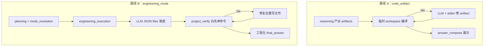

# 代码能力双路径与模式切换

> 对照实现：`engineering_execution` · `code_artifact_pipeline` · `mode_resolution` · `project_verify` · `code_verify`  
> **实现状态**：[`IMPLEMENTATION_STATUS.md`](IMPLEMENTATION_STATUS.md) · **能力矩阵**：[`CAPABILITY_MATRIX.md`](CAPABILITY_MATRIX.md)

本页汇总「写文件 + 编译/构建」与「执行模式切换」的**入口选择**，避免只读 `CODE_ARTIFACT_PIPELINE` 或只读 `ENGINEERING_AGENT_SANDBOX_PROPOSAL` 时漏掉另一半能力。

---

## 0. 主流式交互：先定模式，再规划（`pre_planning`）

自 2026-06 重构起，**planning LLM 之前** 执行 `run_pre_planning_pipeline`：

1. 从 goal + 结构信号推断 `route_audit.inferred_kind`（无需 planner 输出）
2. `mode_resolution` 写入 `target_mode` / 契约 / `writing_intent` 阻断
3. 可选 **显式** `input_payload.interaction_mode`：`chat` | `engineering` | `writing`（对齐 Cursor 的 Ask / Agent-deliver / Writing）

`target_mode == engineering_mode` 且非 steer/replan 时 → **跳过完整 planning LLM**（`engineering_thin_skip`），直接进入 `engineering_execution`（薄计划 + 白名单工具列表）。

```json
{
  "goal": "做一个 2048 网页游戏并落盘",
  "interaction_mode": "engineering"
}
```

### Web UI（`/chat`）

顶栏下拉与 `/mode` 命令写入同一字段，并持久化到 `localStorage`（`agent_interaction_mode`）：

| UI 选项 | `interaction_mode` | 行为 |
|---------|-------------------|------|
| 自动 | （不传） | 仅 `pre_planning` + goal 推断 |
| Ask · 问答 | `chat` | `qa_mode`；`mission_auto: false` |
| Agent · 工程交付 | `engineering` | 有交付意图 → `engineering_mode` + thin planning；**闲聊（如「你好」）仍 `qa_mode`** |
| 写作 · 长篇 | `writing` | `manuscript_mode`；`mission_auto: true` |

**安全说明（相对 Cursor 的「放开」边界）**：工程模式可在会话目录自由落盘多种源码/静态资源，但**不能**在服务端执行用户任意 shell；编译/构建仅 `project_verify` 模板。侧栏「文件」预览已支持 `.cpp/.py/.html/.js` 等。

---

## 1. 两条代码路径（不要混用）

| 维度 | **A. 推理侧 `code_artifact`** | **B. 工程侧 `engineering_mode`** |
|------|--------------------------------|----------------------------------|
| **典型场景** | 问答里给源码、聊天展示 fenced 代码 | 2048 / Makefile demo / 明确要求落盘的可编译工程 |
| **图节点** | `reasoning` → `policy` / `output` | `planning` → **`engineering_execution`** → `policy` |
| **源码落盘** | 否（临时目录 `./data/code_verify`） | 是（会话 artifact 根目录，见 [`SESSION_FILE_TOOLS.md`](SESSION_FILE_TOOLS.md)） |
| **校验模块** | `code_verify.verify_source` | `project_verify.verify_project`（内含 cpp/python 或 web/make） |
| **修复闭环** | `repair_artifacts_via_llm` + stderr | `engineering_bounded`：最小修复 + LLM 再生 `files[]` |
| **用户可见交付** | `answer_compose` 组装 Markdown 代码块 | `format_engineering_answer`：文件清单 + 校验结果 + 预览说明 |
| **配置** | `config.yaml` → `code_artifact` | `mode_contracts.engineering_mode` + `project_verify` |



### 1.1 何时走路径 A

- `target_mode` 为 **`qa_mode`**（或未进工程节点），且满足 `should_process_code_artifacts()`：
  - `route_audit.inferred_kind == code`，或
  - `artifact_profile == source_code`，或
  - `planned_route == writing_code_artifact`
- 详见 [`CODE_ARTIFACT_PIPELINE.md`](CODE_ARTIFACT_PIPELINE.md)。

**注意**：`engineering_mode` 本轮**不走** `ensure_code_artifacts_quality` 主路径；工程校验由 `project_verify` 完成。

### 1.2 工程交付降级与常见 issues

`engineering_execution` 在固定步数预算（默认 `max_steps: 6`）内执行：规划 → 落盘 → 校验 → 修复。最终答案含 **校验结果** 与 **降级说明**（`degraded` / `failed` 时）。

| issue / 说明 | 含义 | 建议 |
|----------------|------|------|
| `no_backend_for_intent` | 未能从 goal + 落盘路径推断 `cpp` / `web_html_js` / `make_cpp_demo` | goal 写明 C++/网页/Makefile；单文件 `main.cpp` 会走 **cpp** 而非 make |
| `no_files_written` | 规划或落盘失败，无文件可校验 | 看 `engineering_trace.write_errors` / `plan_error` |
| `engineering_bounded 步数预算已用尽` | 修复循环占满步数 | 简化目标或调高 `mode_contracts.engineering_mode.execution.max_steps` |
| `verify_concurrency_limit` | 并发校验槽满 | 稍后重试 |
| `verify_exception` | `verify_project` 内部异常 | 查 agent 日志 |

落盘后会根据 **实际文件路径** 重新推断 `intent_kind` 与 `verify_backend`（避免 `general` + 仅「计算器」类 goal 漏配 cpp）。

### 1.2 何时走路径 B

- `mode_routing.by_intent` 将 `code` / `interactive_app` / `small_project` 映射到 **`engineering_mode`**
- 主图 `route_after_planning` → `engineering_execution`（见 [`ROUTE_AUDIT.md`](ROUTE_AUDIT.md) §1）
- 落盘与校验细节见 [`ENGINEERING_AGENT_SANDBOX_PROPOSAL.md`](ENGINEERING_AGENT_SANDBOX_PROPOSAL.md) §8

### 1.3 `project_verify` 白名单 backend

| backend | 用途 | 命令（配置模板，非任意 shell） |
|---------|------|-------------------------------|
| `cpp` | 单文件 C++ | `g++ -std=c++17 -Wall -Wextra -c "{file}"` |
| `python` | 单文件 Python | `python3 -m py_compile "{file}"` |
| `web_html_js` | 浏览器小游戏 | `node --check {entry_js}` + HTML 结构检查 |
| `make_cpp_demo` | 多文件小工程 | 仅允许 `make demo` |

实现：`app/services/project_verify/backends.py` · 工具封装：`verify_backend`（[`verify_backend_tool.py`](../app/services/verify_backend_tool.py)）

---

## 2. 三种执行模式与切换

| 模式 | `target_mode` | 文件写入 | 编译/构建 | 主执行路径 |
|------|---------------|----------|-----------|------------|
| 问答 | `qa_mode` | 契约 `allowed_tools: []` | 仅路径 A（若触发 code artifact） | `reasoning` / SRDL / tools |
| 长篇 | `manuscript_mode` | 写作网关 / mission | 无 | `writing` / `mission` graph |
| 工程 | `engineering_mode` | 节点内落盘 + 可选 `verify_backend` | 路径 B `project_verify` | `engineering_bounded` |

每轮 planning 后 **`run_mode_resolution_pipeline`** 根据本轮 goal 重算模式（非会话创建时一次性锁定）。

### 2.1 切换动作

| `mode_switch_action` | 含义 |
|----------------------|------|
| `stay` | `current_mode == target_mode` |
| `switch` | 换模式，常规继承 |
| `isolate` | 换模式并隔离旧上下文（如活跃 mission → 工程） |

Trace 字段：`current_mode`、`target_mode`、`mode_switch_action`、`mode_switch_reason`（`input_payload` / `mode_resolution`）。

### 2.2 会话内必知规则（§10.2）

| 切换 | 条件（摘要） |
|------|----------------|
| 手稿 → 工程 | 活跃 mission + 工程类 kind → turn policy `isolate_qa` + `mode_resolution` → `engineering_mode`，常伴随 **`isolate`** |
| 工程 → 问答 | 工程模式下 QA 类 intent 或「为什么/怎么设计」类追问 → `qa_mode` |
| 问答 → 工程 | 显式「请直接生成/落盘…」或 engineering intent 置信度达标 → `engineering_mode` |

配置：`mode_routing.by_intent` · `session.turn_policy.isolate_on_kinds` · 代码：`app/services/mode_router.py` → `refine_mode_for_session_switch`。

专文：[`SESSION_TURN_POLICY.md`](SESSION_TURN_POLICY.md) §「与模式路由」· [`ENGINEERING_AGENT_SANDBOX_PROPOSAL.md`](ENGINEERING_AGENT_SANDBOX_PROPOSAL.md) §10。

### 2.3 不能算「随意切换」的限制

- 仅三种正式模式；无运行时 API「强制指定模式」（测试可注入 `current_mode`）
- 切换依赖意图识别与上述规则，非每句无门槛跳转
- 新会话（`new_session: true`）不继承旧 `current_mode` / mission

---

## 3. 安全边界（两路径共用原则）

- **无** `run_shell` / 用户自定义命令；仅配置模板 + `run_command`
- 会话路径：`task_artifact_dir(task_id)` 内相对路径，`..` 与绝对路径拒绝
- 工程校验在独立 `project_verify` workspace 复制后执行
- 各模式契约：`shell_access: false`、`path_scope: session_root_only`

---

## 4. 观测与 CI

| 观测 | 路径 A | 路径 B |
|------|--------|--------|
| structured / trace | `code_verify_ok`、`code_verify_reports`、`code_artifact_repaired` | `engineering_trace`、`engineering_delivery` |
| Golden | reasoning + code artifact 单测 | `integration_cases.json`：2048 / cpp / Makefile / 手稿→工程 |
| CI | `SUITE=integration` 等 | `SUITE=engineering` · 可选 `ENGINEERING_E2E_LIVE=1` |

```bash
SUITE=engineering bash scripts/ci_eval.sh -q
ENGINEERING_E2E_LIVE=1 pytest tests/e2e/test_engineering_mode_live.py -v
```

---

## 5. 相关文档与测试

| 文档 | 内容 |
|------|------|
| [`CODE_ARTIFACT_PIPELINE.md`](CODE_ARTIFACT_PIPELINE.md) | 路径 A 详解 |
| [`ENGINEERING_AGENT_SANDBOX_PROPOSAL.md`](ENGINEERING_AGENT_SANDBOX_PROPOSAL.md) | 路径 B + Mode Contract 长期方案 |
| [`SESSION_FILE_TOOLS.md`](SESSION_FILE_TOOLS.md) | 会话目录文件工具与 API |
| [`ROUTE_AUDIT.md`](ROUTE_AUDIT.md) | `inferred_kind` 与 planning 后纠偏 |
| [`DISPLAY_AND_DELIVERY.md`](DISPLAY_AND_DELIVERY.md) | 展示、流式、`delivery.by_kind` |

| 测试 | 覆盖 |
|------|------|
| `tests/services/test_pre_planning.py` | `interaction_mode`、thin-skip 判定 |
| `tests/integration/test_planning_engineering_thin.py` | planning 不调用 LLM |
| `tests/services/test_manuscript_payload_coerce.py` | 非 dict payload、工程 basename |
| `tests/integration/test_engineering_mode_flow.py` | 图路由工程交付 |
