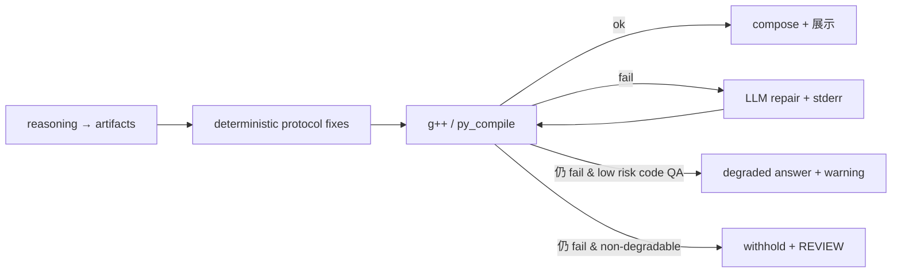

# Code Artifact Pipeline

> 代码类任务：以**编译校验为主裁判**；失败时先走**确定性最小修复**，再走 **LLM + compiler stderr 修复**。  
> **不**使用面向用户话术的关键词硬编码，也 **不**在 repair 提示中硬编码缩进风格（如「C++ 每层 4 空格」）；允许少量**编译器无关但协议相关**的确定性修复（如 `static _cast` → `static_cast`、流式 token 粘连空白恢复）。  
> 对 LOW 风险代码问答，最终仍失败时允许**降级展示未校验源码并显式告警**，而不是一律卡人工审核。  
> 实现：`app/services/code_artifact_pipeline.py` · `app/services/code_verify/` · `config.yaml` → `code_artifact`

---

## 1. 设计原则

| 原则 | 说明 |
|------|------|
| 编译器主裁判 | `g++ -c` / `python3 -m py_compile` 通过 → `code_verify_ok`；否则进入修复或降级 |
| 分层修复 | 先做**协议相关的确定性最小修复**（空白粘连、已知 token 破坏），再调用 [`repair_artifacts_via_llm()`](../app/services/code_artifact_pipeline.py:80) 基于 `compiler_stderr` 修复 |
| 无话术硬编码 | 不根据用户问题关键词决定结果；是否修复/降级取决于 `artifact_profile`、`route_audit`、风险等级与编译结果 |
| 展示保空白 | `display.compose.preserve_code_whitespace` + [`normalize_code_content()`](../app/services/answer_compose.py:19) 只去掉末尾换行，不改行首空格/Tab |
| 低风险降级 | LOW 风险代码问答在最终仍未通过编译时，可设置 `code_verify_degraded=true` 并显式告警展示源码 |
| 高风险仍审核 | 非低风险任务或不可降级场景，`code_verify_failed` 继续走 **REVIEW** |

**已移除（勿在 trace / 文档中再依赖）：**

- `code_artifact_normalized`、`code_quality_reports`、`code_quality`（启发式质量/压扁检测）
- 正则 `normalize` 改源码、`assess_*` 类排版评分

---

## 2. 流水线



| 步骤 | 模块 | 说明 |
|------|------|------|
| 1 | `reasoning_node` | 产出 `structured.artifacts[]`（协议见 `REASONING_ROLE`） |
| 2 | `ensure_code_artifacts_quality` | `verify_code_artifacts` 写临时文件并编译 |
| 3 | `repair_artifacts_via_llm` | `on_failure: repair` 且 `repair.enabled` 时，用 stderr 修 artifacts，最多 `verify.max_attempts` 轮 |
| 4 | `answer_compose` / `policy_engine` | `code_verify_ok` 才组装 fenced 代码；失败则 withhold + **REVIEW** |

触发条件：`code_artifact.enabled` 且 `route_audit.inferred_kind=code` 或 `artifact_profile=source_code`（见 `should_process_code_artifacts`）。

---

## 3. LLM 修复（`repair_artifacts_via_llm`）

**System 提示要点（与代码一致）：**

- 根据 `compiler_stderr` 修到可编译；保留程序意图
- 完整源码放入 `artifacts[].content`，使用真实换行，无 markdown fence
- **不**在 stderr 未要求时强加风格规则

**User 载荷字段：** `goal`、`language`、`compiler_stderr`、`artifacts_to_repair[]`

**不修复的情况：** `compiler_stderr` 为空、`repair.enabled=false`、`on_failure=mark_failed`、LLM 不可用或返回无效 JSON → 设置 `code_artifact_repair_failed`。

---

## 4. 配置

```yaml
code_artifact:
  enabled: true
  output:
    hide_unverified_code: true
    failure_message: >
      代码未通过编译校验，本次不展示可能错误的源码。
      请重试；技术细节见推理 trace（code_verify_reports）。
  repair:
    enabled: true
    llm_purpose: reasoning   # get_llm(purpose) 用于 compile-error repair
  stream:
    mode: composed_at_end      # composed_at_end | artifact_incremental
  verify:
    enabled: true
    on_failure: repair       # repair | mark_failed
    max_attempts: 3
    timeout_sec: 15
    workspace_root: ./data/code_verify
  backends:
    cpp:
      enabled: true
      source_extension: .cpp
      compile_cmd: [g++, -std=c++17, -Wall, -Wextra, -c, "{file}"]
    python:
      enabled: true
      source_extension: .py
      compile_cmd: [python3, -m, py_compile, "{file}"]
  default_backend_by_language:
    cpp: cpp
    python: python
```

Docker 覆盖项见 `config/config.docker.yaml`（`workspace_root: /data/code_verify`）。

---

## 5. 观测字段（`structured` / trace）

| 字段 | 含义 |
|------|------|
| `code_verify_ok` | 编译通过 |
| `code_verify_failed` | 未通过（通常已 withhold 展示） |
| `code_verify_reports` | 每轮 compile 的 `stderr` / `exit_code` / `backend` |
| `code_artifact_repaired` | LLM 根据 stderr 至少修过一轮 |
| `code_artifact_repair_failed` | repair 未返回可用 artifacts |

推理 trace 中对应行：`code_verify: ok|failed`、`code_verify_reports`、`code_artifact: repaired|repair_failed`（见 `reasoning_trace.py`）。

---

## 6. 与展示 / 记忆 / 策略的衔接

| 消费方 | 行为 |
|--------|------|
| [`answer_compose.py`](../app/services/answer_compose.py) | `should_include_code_artifacts`；失败时 `verify_failure_user_message` |
| [`policy_engine.py`](../app/services/policy_engine.py) | `code_verify_failed` → **REVIEW** |
| [`memory_writeback_policy.py`](../app/services/memory_writeback_policy.py) | `code_verify_failed` 轮次跳过 episode 索引 |
| [`DISPLAY_AND_DELIVERY.md`](DISPLAY_AND_DELIVERY.md) | 空白保留、流式、`delivery.by_kind.code` |

---

## 7. 相关文档与测试

- [`ROUTE_AUDIT.md`](ROUTE_AUDIT.md) — 任务种类与 `writing_code_artifact` 路由
- [`DISPLAY_AND_DELIVERY.md`](DISPLAY_AND_DELIVERY.md) — 展示与记忆写回
- [`IMPLEMENTATION_STATUS.md`](IMPLEMENTATION_STATUS.md) — 实现状态表
- [`answer_compose.py`](../app/services/answer_compose.py) — reasoning artifacts 组装与交付门控

单测：

- `tests/services/test_code_artifact_pipeline.py`
- `tests/services/test_code_artifact_verify_integration.py`
- `tests/services/test_code_verify.py`
- `tests/services/test_answer_compose_verify_gate.py`
