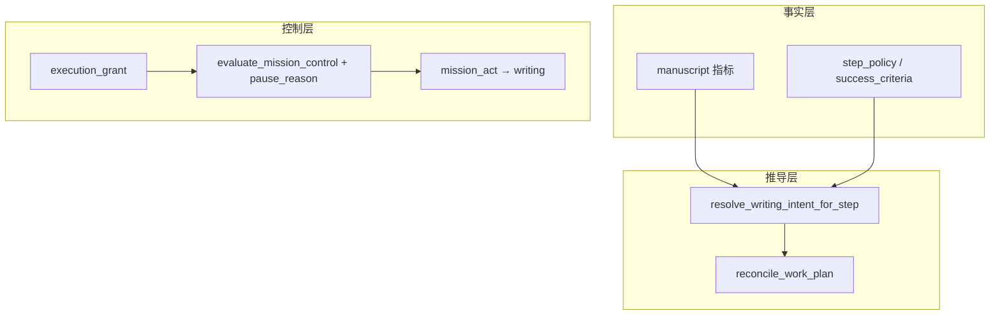

# Mission 执行控制（execution grant / work-plan reconcile）

> 版本：1.0 · 状态：已实现  
> 实现：`app/services/mission_execution.py` · 与编排见 [`MANUSCRIPT_WRITING.md`](MANUSCRIPT_WRITING.md) §11

## 解决的问题

| 现象 | 根因 |
|------|------|
| 用户「继续」后只收到大纲复述、正文 0 字节 | `stepwise` 在 `mission_decide` 直接 `pause→finalize`，未进入 `mission_act` / `writing` |
| 编排显示 `write_outline` pending，但 `outline.txt` 已有内容 | `work_plan` 投影与 `manuscript` 事实不同步 |
| `mission_finalize` 调用 reasoning 流式输出全文大纲 | 无本回合 `artifact_delta` 时仍走 LLM 综合 |

**原则**：下一步写什么由 **手稿度量 + step_policy** 推导；`work_plan` 是可重建的投影；恢复执行走 **显式 control-plane**，不靠正文关键词表。

---

## 架构分层



| 模块 | 职责 |
|------|------|
| `mission_execution.py` | `execution_grant`、`pause_reason` 常量、`reconcile_work_plan`、`work_item_satisfied`、`artifact_delta`、`build_mission_checkpoint_summary` |
| `mission_schema.resolve_writing_intent_for_step` | 由手稿 + policy 推导 `writing_intent`（state 与磁盘字节取 max） |
| `progress_evaluator` | 程序谓词优先；`step_checkpoint` 遇 grant 则 `continue` |
| `mission_finalize_node` | 无 `artifact_delta` 时用 checkpoint 摘要，不调 reasoning LLM |

---

## execution_grant（控制面）

一次性令牌，写在 `input_payload.execution_grant`：

```json
{
  "issued_at": "2026-05-28T12:00:00+00:00",
  "source": "resume_api",
  "consume_once": true
}
```

| 签发来源 `source` | 时机 |
|-----------------|------|
| `resume_api` | `POST /tasks/{id}/resume`（`prepare_resume_mission`） |
| `continue_signal` / `explicit_request` / … | Session turn 判定 `resume_mission` 且 **机械续写**（`is_mechanical_resume_decision`） |
| `intervention` | 显式 `mission_intervention` 随请求进入 |

**消费**：`mission_decide` 在 `action=continue` 时 `consume_execution_grant`（整包替换 `input_payload`，避免 merge 残留 grant）。

**签发时**会清除 `steer_*_pending_confirm` 等闸门字段，并标记 `steer_planning_done`，避免「用户已说继续」仍被 Outcome/Intent 门闸或规划闸门挡住。

**求值优先级**：`evaluate_mission_control` 在任意 pause 判定之前，若存在 grant → 直接 `continue`（同轮进入 `mission_act` / `writing`）。

**与 steer 规划闸门**：已有 grant 且非 forced intervention 时，不挂 `require_planning_after_steer`；`_prepare_mission_for_turn` 直接 `apply_mission_step_to_payload` 启用 `writing_intent`。

---

## pause_reason（暂停分型）

`mission_control.pause_reason`（`evaluate_mission_control` → `EvalResult.pause_reason`）：

| 值 | 含义 | 恢复方式 |
|----|------|----------|
| `step_checkpoint` | stepwise 每步暂停 | `POST /resume` 或机械续写 session turn（签发 grant） |
| `gate_intent` / `gate_outcome` | HITL 闸门 | `{"confirm": true}` |
| `steer_queued` | 运行中 steer 队列未消费 | 等待边界消费或暂停后 steer |
| `human_gate` | 编排人工检查点 | 同 step_checkpoint |
| `budget` / `forced` / `failure` | 预算、强制暂停、失败 | 见 mission 文档 |

---

## work_plan reconcile

在 `mission_observe`、`mission_decide`、`apply_work_plan_to_payload` 调用 `reconcile_work_plan`：

1. 对 pending/running 项用 `work_item_satisfied(kind)` 对照手稿谓词标 `done`
2. 去重同 kind 的重复 pending
3. lazy 模式无 pending 时，由 `build_next_lazy_work_item`（内部 `resolve_writing_intent_for_step`）追加下一项

谓词示例（机械，非 NLP）：

- `write_outline` ⇔ `outline_path` 存在且 `outline_bytes >= MANUSCRIPT_MIN_OUTLINE_CHARS`
- `append_body` / `write_body` ⇔ `body_path` 存在且 `body_bytes >= MANUSCRIPT_MIN_BODY_CHARS`

---

## 输出策略（finalize）

| 条件 | 用户可见摘要 |
|------|----------------|
| 本回合 `observation.artifact_delta.has_change` | 正常 `reasoning_node` 或 mission 写后摘要 |
| 写作 mission + 无 delta + `pause` | `build_mission_checkpoint_summary`（进度、编排、resume 提示） |
| 有 `reasoning_result` 且非 checkpoint | 保留已有结果 |

避免在无写盘进展时用 LLM 把 `outline.txt` 全文复述进 `final_answer`。

---

## writing_llm_decide 与机械推导的边界

| 层 | 决定什么 | 实现 |
|----|----------|------|
| **机械** | 是否存在大纲/正文、下一 `action` 类型（outline / write_body / append_body）、work_plan 是否过期 | `resolve_writing_intent_for_step`、`work_item_satisfied`、`reconcile_work_plan` |
| **模型**（`mission.writing_llm_decide=true`） | 在机械允许的执行器内选 `writing_phase`（审阅、润色、摘要、一致性等） | `mission_decide` + `MISSION_WRITING_DECIDE_SYSTEM` |
| **模型**（steer） | 改纲、改剧情、强制 intervention | `planning` → `mission_intervention` / `work_plan_patch` |

模型 **不** 判断「大纲是否已写完」；该判断仅来自 `manuscript` 与 `step_policy`。

---

## 测试

- `tests/services/test_mission_execution.py`
- `tests/nodes/test_mission_finalize_checkpoint.py`
- 既有 `test_mission_orchestrator.py`、`test_mission_steer_planning_gate.py`
