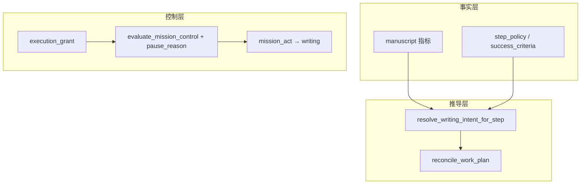

# Mission 执行控制（execution grant / work-plan reconcile）

> 版本：1.0 · 状态：已实现  
> 实现：`app/services/mission_execution.py` · 与编排见 [`MANUSCRIPT_WRITING.md`](MANUSCRIPT_WRITING.md) §11

## 解决的问题

| 现象 | 根因 |
|------|------|
| 用户「继续」后只收到大纲复述、正文 0 字节 | `stepwise` 在 `mission_decide` 直接 `pause→finalize`，未进入 `mission_act` / `writing` |
| 编排显示 `write_outline` pending，但 `outline.txt` 已有内容 | `work_plan` 投影与 `manuscript` 事实不同步 |
| `mission_finalize` 调用 reasoning 流式输出全文大纲 | 无本回合 `artifact_delta` 时仍走 LLM 综合 |

**原则**：下一步写什么由 **手稿度量 + step_policy** 推导；`work_plan` 是可重建的投影；恢复执行走 **显式 control-plane**，不靠正文关键词表。与此并行，所有 planning / reasoning / writing / reviewing 的模型输入统一经 [`Context Governance`](ADR_CONTEXT_GOVERNANCE.md) 组包，Mission 控制面不再默认直接消费原始全量 transcript，而是消费按 `purpose` 裁剪后的 governed context。

---

## 架构分层



| 模块 | 职责 |
|------|------|
| `mission_execution.py` | `execution_grant`、`pause_reason` 常量、`reconcile_work_plan`、`work_item_satisfied`、`artifact_delta`、`build_mission_checkpoint_summary` |
| `mission_schema.resolve_writing_intent_for_step` | 由手稿 + policy 推导 `writing_intent`（state 与磁盘字节取 max） |
| `progress_evaluator` | 程序谓词优先；`step_checkpoint` 遇 grant 则 `continue` |
| `mission_finalize_node` | 无 `artifact_delta` 时用 checkpoint 摘要，不调 reasoning LLM |

---

## execution_grant（控制面）

一次性令牌，写在 `input_payload.execution_grant`：

```json
{
  "issued_at": "2026-05-28T12:00:00+00:00",
  "source": "resume_api",
  "scope": "mechanical_resume",
  "consume_once": true
}
```

**与 steer 优先级**（`app/services/intent_composer.py`）：存在 `require_planning_after_steer` / 未完成的 steer 快照时，不得签发或消费 `mechanical_resume` grant；`planning_fallback` 的 `execution_grant_forward` 同样受此约束。材料级 steer 可触发 `batch_unit_quality` agenda 投影（`app/services/mission/batch_unit_work_plan.py`）：`review_chapter` + `polish_chapter`（`depends_on`），`work_item_satisfied` 与 `validate_turn_contract_execution` 校验 `review_chapter` 已执行。大批量 agenda 插入走 `confirmation_gates.plan_gate_min_prepend_items`（intent 确认门）。契约指标：`contract_unfulfilled` / `contract_fulfilled`。

**执行器存活性**（`app/services/graph_run_registry.py` + `app/services/mission_worker_lost.py`）：每次 graph run 会登记 `run_id` 到进程内 registry，并把 `execution_run` 元信息写回 state。读取任务状态时，若发现持久化状态仍是 `MISSION_RUNNING`，但 registry 中已无对应执行器，则自动 reconcile 为 `MISSION_PAUSED` + `pause_reason=worker_lost`。这解决了“刷新 SSE 后 live 被清掉”与“进程重启后任务永远显示 running”两个控制面问题。

**TurnKind 与 planning→executor**（[`ADR_TURN_KIND.md`](ADR_TURN_KIND.md)）：`input_payload.turn_kind` 区分 `steer_replan` / `steer_execute` / `mission_step_execute` 等；`session_turn` 与 `graph_runner` 统一经 `apply_steer_message` 挂规划闸门。`run_pipeline_request` 在规划后若 `pipeline_phase_after_planning == execute` 则 bootstrap agenda 头并禁止以 reasoning 代替执行；trace/UI 计划行以 `plan_steps_for_display`（contract + agenda）为准。`primary_op=pause` 且 agenda 仍有可执行项时，`contract_requires_side_effects(..., state=)` 为 true。

| 签发来源 `source` | 时机 |
|-----------------|------|
| `resume_api` | `POST /tasks/{id}/resume`（`prepare_resume_mission`） |
| `continue_signal` / `explicit_request` / … | Session turn 判定 `resume_mission` 且 **机械续写**（`is_mechanical_resume_decision`） |
| `intervention` | 显式 `mission_intervention` 随请求进入 |

**消费**：`mission_decide` 在 `action=continue` 时 `consume_execution_grant`（整包替换 `input_payload`，避免 merge 残留 grant）。

**签发时**会清除 `steer_*_pending_confirm` 等闸门字段，并标记 `steer_planning_done`，避免「用户已说继续」仍被 Outcome/Intent 门闸或规划闸门挡住。

**求值优先级**：`evaluate_mission_control` 在任意 pause 判定之前，若存在 grant → 直接 `continue`（同轮进入 `mission_act` / `writing`）。

**与 steer 规划闸门**：已有 grant 且非 forced intervention 时，不挂 `require_planning_after_steer`；`_prepare_mission_for_turn` 直接 `apply_mission_step_to_payload` 启用 `writing_intent`。

---

## pause_reason（暂停分型）

`mission_control.pause_reason`（`evaluate_mission_control` → `EvalResult.pause_reason`）：

| 值 | 含义 | 恢复方式 |
|----|------|----------|
| `step_checkpoint` | stepwise 每步暂停 | `POST /resume` 或机械续写 session turn（签发 grant） |
| `gate_intent` / `gate_outcome` | HITL 闸门 | `{"confirm": true}` |
| `steer_queued` | 运行中 steer 队列未消费 | 等待边界消费或暂停后 steer |
| `worker_lost` | 持久化 RUNNING 但本进程无 graph worker（重启、SSE 断开后 worker 已消失等） | 插入/steer 后立即 merge；续跑需 `/resume` 或机械继续 |
| `human_gate` | 编排人工检查点 | 同 step_checkpoint |
| `budget` / `forced` / `failure` | 预算、强制暂停、失败 | 见 mission 文档 |

---

## work_plan reconcile

在 `mission_observe`、`mission_decide`、`apply_work_plan_to_payload` 调用 `reconcile_work_plan`：

1. 对 pending/running 项用 `work_item_satisfied(kind)` 对照手稿谓词标 `done`
2. 去重同 kind 的重复 pending
3. lazy 模式无 pending 时，由 `build_next_lazy_work_item`（内部 `resolve_writing_intent_for_step`）追加下一项

谓词示例（机械，非 NLP）：

- `write_outline` ⇔ `outline_path` 存在且 `outline_bytes >= MANUSCRIPT_MIN_OUTLINE_CHARS`
- `append_body` / `write_body` ⇔ `body_path` 存在且 `body_bytes >= MANUSCRIPT_MIN_BODY_CHARS`

### agenda / DAG 扩展（最新）

最近一轮升级后，`work_plan` 不再只被视作「线性懒加载队列」，而是开始向 **dependency-aware agenda** 演进：核心实现位于 [`task_agenda.py`](../app/services/task_agenda.py)。它解决的不是“下一步叫什么”，而是“多个计划项之间能否并行表达依赖、失败后如何阻塞传播、局部重规划如何只重置一段切片”。

当前 agenda 层新增了几类关键能力：

- [`ensure_agenda_fields()`](../app/services/task_agenda.py:16)：把 `depends_on`、`status`、`agenda_version` 规范化，确保旧 `work_plan` 也能升级为 agenda 视图。
- [`runnable_items()`](../app/services/task_agenda.py:57) / [`select_next_runnable_item()`](../app/services/task_agenda.py:69)：从“只看队头”升级为“找依赖已满足的可运行项”。
- [`propagate_failure()`](../app/services/task_agenda.py:112)：某个 item 失败后，把依赖它的后继项批量标记为 `blocked`，避免继续执行下游步骤。
- [`local_replan_slice()`](../app/services/task_agenda.py:233)：只重置失败节点及其受影响分支，而不是把整份 `work_plan` 全量打回重来。
- [`items_from_plan_steps()`](../app/services/task_agenda.py:148)：可从 planning 产出的自然语言 `plan[]` 构造 agenda item；若 planning 还给出 `tool_dag`，则进一步生成 tool-step DAG，把工具依赖边写进 `depends_on`。

这意味着 Mission control 里的「计划」开始分成两层：

- **控制面 work_plan**：仍然是持久化、resume、checkpoint、UI 展示的主载体。
- **执行面 agenda**：在其上表达依赖、阻塞、局部重规划与 tool DAG。

因此，当前项目已经不再只有“stepwise 写作队列”，而是具备了把 planning 结果投影成 **agenda + DAG** 的基础能力。对外描述时，更准确的说法应是：Mission Runtime 仍以 `work_plan` 为事实投影，但其内部执行语义已经升级为 **可表达依赖关系的 agenda queue**，而不是纯顺序列表。

---

## 输出策略（finalize）

| 条件 | 用户可见摘要 |
|------|----------------|
| 本回合 `observation.artifact_delta.has_change` | 正常 `reasoning_node` 或 mission 写后摘要 |
| 写作 mission + 无 delta + `pause` | `build_mission_checkpoint_summary`（进度、编排、resume 提示） |
| 有 `reasoning_result` 且非 checkpoint | 保留已有结果 |

避免在无写盘进展时用 LLM 把 `outline.txt` 全文复述进 `final_answer`。

---

## writing_llm_decide 与机械推导的边界（历史说明）

> **2026-06-05 起**：`writing_llm_decide` 已进入退役流程。默认 **hard-off**（`allow_legacy_writing_path=false`）。
> 写作域唯一长期执行面为 **OMAW worker orchestration**；Mission 图仅作控制面。
> 详见 [`INTENT_OBSERVATION_AND_OMAW_MIGRATION_PLAN.md`](INTENT_OBSERVATION_AND_OMAW_MIGRATION_PLAN.md)。

| 层 | 决定什么 | 实现 |
|----|----------|------|
| **机械（当前默认）** | OMAW orchestrator 派单；`FactBundle` + `WorkerExecutionPolicy` 硬约束 | `mission_oma/orchestrator.py`、`prepare_worker_execution` |
| **机械（历史）** | 是否存在大纲/正文、下一 `action` 类型 | `resolve_writing_intent_for_step`、`work_item_satisfied` |
| **模型（已废弃）** | `mission.writing_llm_decide=true` 且 `allow_legacy_writing_path=true` 时 LLM 自选 `writing_phase` | `mission_decide` + `MISSION_WRITING_DECIDE_SYSTEM` — 仅兼容层，命中审计 |
| **模型（steer）** | 改纲、改剧情、强制 intervention | `planning` → `mission_intervention` / `work_plan_patch` |

模型 **不** 判断「大纲是否已写完」；该判断仅来自 `manuscript` 与 `step_policy`。

---

## 测试

- `tests/services/test_mission_execution.py`
- `tests/nodes/test_mission_finalize_checkpoint.py`
- 既有 `test_mission_orchestrator.py`、`test_mission_steer_planning_gate.py`
