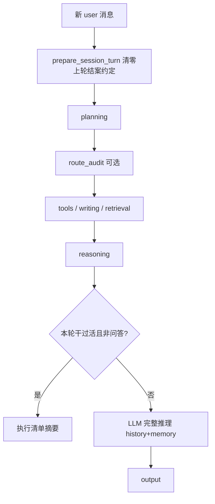

# 多轮推理隔离（Reasoning shortcut policy）

> 防止「上一轮写完就结案」污染下一轮问答；防止仅凭磁盘上的旧手稿文件生成「文件多大」式回答。  
> 实现：[`app/services/reasoning_shortcut.py`](../app/services/reasoning_shortcut.py)

---

## 1. 背景

典型故障（同一会话多轮）：

1. 用户先触发**写作**（例如误生成 `novel.txt`）。
2. 系统在本轮结束时进入「**用执行清单代替深度思考**」模式。
3. 下一轮用户问「**你之前做过什么？**」（纯问答）。
4. 系统仍用清单模式，只回复「手稿 xxx 字节」，**忽略**已检索到的对话记忆与 history。

根因不是规划选错路，而是**跨轮状态残留** + **摘要逻辑把「磁盘上有文件」当成「本轮成果」**。

---

## 2. 设计原则（用作用描述）

| 原则 | 作用 |
|------|------|
| **每轮重新起跑** | 新 user 消息不继承上一轮的「写完即可结案」约定 |
| **摘要仅属本棒** | 只有本轮真的跑过工具/写作，才允许用执行清单代替 LLM |
| **问答必须想全** | 路径审计判定为问答/重试回顾时，强制完整推理 |

与 [`ROUTE_AUDIT.md`](ROUTE_AUDIT.md) 互补：route audit 解决「**走哪条路**」；本模块解决「**走完路后，下一轮怎么思考**」。

---

## 3. 流水线



---

## 4. 运行时落点

| 时机 | 行为 |
|------|------|
| [`prepare_session_turn()`](../app/services/session_turn.py) | `_reset_execution_fields` 调用 `clear_turn_carryover()` |
| [`run_route_audit_pipeline()`](../app/services/route_audit/pipeline.py) | 问答/重试类 kind → `normalize_reasoning_policy()` |
| [`reasoning_node()`](../app/nodes/reasoning_node.py) | `should_use_execution_summary()` 门禁；通过才用清单 |

### 4.1 何时允许「执行清单」代替 LLM

同时满足：

- 本轮配置允许「工具/写作后快速结案」
- 未要求「必须慢推理」
- 路径审计**未**判定为问答/重试回顾（高置信）
- **本轮**确有工具结果或写作完成（不是仅磁盘上存在旧文件）

### 4.2 清单里有什么

- 本轮工具输出路径/结果
- **仅当本轮执行过写作**时，才附带手稿路径与字节数

---

## 5. 与 route_audit 的协作

| 模块 | 管什么 |
|------|--------|
| `route_audit` | 规划后：代码 vs 手稿路径是否一致 |
| `reasoning_shortcut` | 推理前：是否允许跳过 LLM；每轮清零 |

`route_audit` 纠正写作路径时，也会打开「必须慢推理」。  
`inferred_kind` 为 `qa` / `retry_recovery` 时，`normalize_reasoning_policy` 关闭快速结案。

配置见 `config.yaml` → `route_audit.kinds`（无需为每种用户措辞改代码）。

---

## 6. 验证

单测：[`tests/services/test_reasoning_shortcut.py`](../tests/services/test_reasoning_shortcut.py)

```bash
pytest tests/services/test_reasoning_shortcut.py tests/services/test_session_turn.py -q
```

手工：同会话先触发写作，再问「你之前做过什么？」——应出现完整推理 trace，回答应概括会话历史，而非仅报 `novel.txt` 字节数。

---

## 7. 相关文档

- [`ROUTE_AUDIT.md`](ROUTE_AUDIT.md) — 规划后路径审计
- [`MANUSCRIPT_WRITING.md`](MANUSCRIPT_WRITING.md) — Writing 节点与 Reasoning 协议
- [`conversation_context.py`](../app/services/conversation_context.py) — 多轮上下文与历史写回
