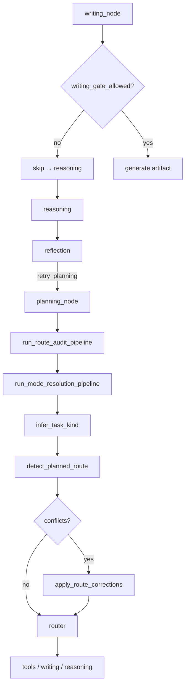

# Route Audit（规划后路径审计）

> 长期工程化方案：用**可配置规则**对齐「用户任务类型」与「规划选定的执行路径」，避免 planner 将代码任务误路由到手稿 `novel.txt` 写作网关。  
> 实现：`app/services/route_audit/` · 配置：`config/config.yaml` → `route_audit`

---

## 1. 解决的问题

| 现象 | 根因 |
|------|------|
| 用户要 C++ / 重试失败代码，却生成 `novel.txt` 小说 | `writing_intent` + `write_body` + 固定「Story prose only」artifact 提示 |
| 全流程 `policy` / `output_guard` 仍通过 | 治理层不检查「路径是否与 goal 一致」 |
| 现有 reflection 拦不住 | 位于 reasoning 之后；且曾默认 `writing_only`，只复核摘要不审路由 |

Route audit 在 **planning 完成之后、tool/writing 执行之前** 插入审计与纠正。

与 **模式路由** 的分工：

| 模块 | 时机 | 职责 |
|------|------|------|
| `route_audit` | planning 后 | 推断 `inferred_kind`、比对 `planned_route`、纠正写作误路由 |
| `mode_resolution` | route_audit 之后 | `intent_kind` → `target_mode`，加载 `mode_contracts`，写入 trace |

工程类 kind（`interactive_app` / `small_project` / `code`）在 `mode_routing` 中统一映射到 `engineering_mode`，由主图 `engineering_execution` 节点执行，不再依赖 planner 自觉落盘。

---

## 2. 流水线



---

## 3. 部署注意（Docker）

`config/config.docker.yaml` 必须包含与 `config.yaml` **相同的** `route_audit.kinds` 与 `route_audit.conflicts`。  
若仅有 `enabled: true` 而无 `kinds`/`conflicts`，审计模块不会拦截任何写作路径（表现为代码任务仍 append `novel.txt`）。

---

## 4. 配置结构（`route_audit`）

```yaml
route_audit:
  enabled: true
  min_kind_score: 0.35
  reflection_on_misroute: true
  max_planning_revisions: 1
  code_extensions: [".cpp", ".py", ...]
  manuscript_body_names: ["novel.txt", "body.txt"]
  kinds:
    code:
      weight: 1.0
      patterns: ['(?i)\\b(c\\+\\+|cpp|python)...']   # 可扩展正则
      structural: [code_filename_in_tools]
    manuscript: ...
    qa: ...
    retry_recovery: ...
  conflicts:
    - when_kind: code
      planned_route: writing_manuscript
      action: disable_writing_force_reasoning
```

### 3.1 Task kind 推断

- **patterns**：对 `goal` + 近期 user 消息 + `session_outcomes` 摘要做正则打分（改配置即可，不改 Python）。
- **structural**：纯状态信号，例如：
  - `writing_intent_enabled`
  - `mission_writing`
  - `session_outcomes_rejected_recent`
  - `code_filename_in_tools`
  - `long_form_chars_requested`

### 3.2 Planned route

从规划结果推导，例如：`writing_manuscript` | `writing_code_artifact` | `writing_outline` | `tools_then_reasoning` | `reasoning_only` | `mission_writing`。

### 3.3 Conflicts 与 actions

| action | 效果 |
|--------|------|
| `disable_writing_force_reasoning` | 关闭 `writing_intent`、`force_slow_reasoning=true`；`writing_manuscript` 等剥离 writing 工具；`writing_tools_only` 保留 `write_text_artifact` 并 `rewrite_tool_filenames` |
| `disable_writing` | 仅关闭写作路径 |

`unless_kind`：当另一 kind 分数足够高时跳过该条冲突（例如明确要写小说时不因 `retry_recovery` 误杀）。

---

## 4. 运行时落点

| 组件 | 行为 |
|------|------|
| [`planning_node`](../app/nodes/planning_node.py) | 每轮规划结束调用 `run_route_audit_pipeline` |
| [`pipeline.py`](../app/services/route_audit/pipeline.py) | 审计后输出 **【路由审计】** / **【生效计划】** trace |
| [`delivery_policy.py`](../app/services/delivery_policy.py) | `delivery.by_kind` 交付策略与文件名改写 |
| [`router.py`](../app/runtime/router.py) | `writing_gate_allowed()` 控制是否进入 `writing` |
| [`writing_node`](../app/nodes/writing_node.py) | 入口二次门禁；misroute 时不 `skip_reasoning_after_tools` |
| [`artifact_content.py`](../app/services/artifact_content.py) | `artifact_profile`: `source_code` / `manuscript_prose` / `outline` |
| [`reflection_node`](../app/nodes/reflection_node.py) | `route_audit.aligned=false` → `retry_planning` |
| [`graph.py`](../app/runtime/graph.py) | `reflection → planning` 边 |

`input_payload.route_audit` 字段示例：

```json
{
  "inferred_kind": "code",
  "planned_route": "writing_manuscript",
  "aligned": false,
  "issues": ["task_kind=code conflicts with planned_route=writing_manuscript ..."],
  "corrections": ["disable_writing_intent", "strip_writing_tools", "force_slow_reasoning"],
  "delivery_plan": {"primary": "reasoning_artifacts", "secondary": "tool_write"}
  "writing_blocked": true,
  "artifact_profile": "source_code"
}
```

---

## 5. Reflection 与重规划

`config.yaml` → `reflection`：

```yaml
reflection:
  enabled: true
  max_rounds: 2
  writing_only: false              # 允许非写作路径也进入 reflection
  route_audit_on_misroute: true    # aligned=false 时必反思
```

- `retry_planning`：回到 `planning_node`，并注入 `route_audit_replan_feedback`。
- 受 `route_audit.max_planning_revisions` 与 `reflection.max_rounds` 限制，防止循环。

---

## 6. 与代码输出协议的关系

| 任务 | 正确路径 |
|------|----------|
| 源码（C++/Python 等） | `writing_intent.enabled=false` → `reasoning` + `structured.artifacts[]` → [`answer_compose`](../app/services/answer_compose.py) |
| 长篇手稿 | `writing_intent` / `mission` → `writing_node` → `novel.txt` |
| 若 planner 为代码选了 `.cpp` 文件写入 | `artifact_profile=source_code`，artifact 网关用代码提示，而非小说正文 |

详见 [`MANUSCRIPT_WRITING.md`](MANUSCRIPT_WRITING.md) Reasoning 节 · [`prompt_templates.py`](../app/config/prompt_templates.py) 中 `REASONING_ROLE` / `PLANNING_ROLE`。

---

## 7. 扩展指南

1. **新业务域**：在 `route_audit.kinds` 增加 kind + patterns / structural。
2. **新冲突**：在 `conflicts` 增加 `when_kind` + `planned_route` + `action`。
3. **新结构信号**：在 `signals.py` 的 `collect_structural_signals` 增加布尔特征，并在 config 的 `structural` 列表中引用。
4. **观测**：审计写入 `audit_log` phase `route_audit`；可按 `issues` / `inferred_kind` 聚合监控。

单测：[`tests/services/test_route_audit.py`](../tests/services/test_route_audit.py)

---

## 8. 多轮推理隔离

专文：[`REASONING_SHORTCUT.md`](REASONING_SHORTCUT.md)（与 route audit 互补：一个管「走哪条路」，一个管「下一轮怎么思考」）。

---

## 9. 相关文档

- [`CODE_AND_ENGINEERING_PATHS.md`](CODE_AND_ENGINEERING_PATHS.md) — `code_artifact` vs `engineering_mode`、模式切换、`project_verify` backend
- [`ENGINEERING_AGENT_SANDBOX_PROPOSAL.md`](ENGINEERING_AGENT_SANDBOX_PROPOSAL.md) — `engineering_mode` 契约与 `engineering_bounded`
- [`DISPLAY_AND_DELIVERY.md`](DISPLAY_AND_DELIVERY.md) — 缩进保留、流式 artifacts、记忆写回
- [`CODE_ARTIFACT_PIPELINE.md`](CODE_ARTIFACT_PIPELINE.md) — 推理侧编译校验与 stderr 修复（路径 A）
- [`REASONING_SHORTCUT.md`](REASONING_SHORTCUT.md)
- [`graph_runner.py`](../app/services/graph_runner.py) — 图执行与服务层编排
- [`IMPLEMENTATION_STATUS.md`](IMPLEMENTATION_STATUS.md)
- [`CAPABILITY_MATRIX.md`](CAPABILITY_MATRIX.md)
