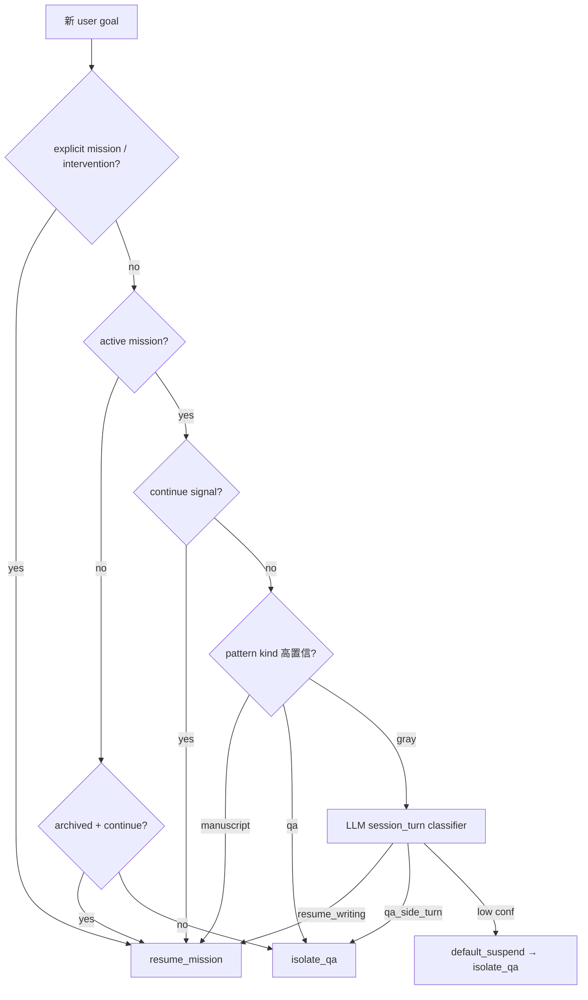

# Session Turn Policy（会话轮次策略）

> 业界模式：**显式状态机** + **配置 fast path** + **LLM 灰区分类**  
> 实现：`app/services/session/` · 配置：`config/config.yaml` → `session.turn_policy`

---

## 1. 解决的问题

| 现象 | 根因 |
|------|------|
| 写作 mission 进行中，用户发 `hello` 却弹出 `novel.txt` 手稿流 | 同 session 持久化 mission，每轮默认 re-enter mission graph |
| 靠 Python 关键词 / 问候语 regex 区分 QA |  brittle，难维护，非长期方案 |

**核心原则**：有 active writing mission 时，**默认挂起（suspend）**，只有明确 resume 信号才恢复 mission 运行时。

---

## 2. 决策流水线



---

## 3. Resume 信号（优先级从高到低）

1. **显式 contract**：`execution_mode: mission`、`mission` block、`mission_intervention`
2. **Continue 信号**：`continue_goal_patterns`（配置）+ `is_continue_writing_goal`
3. **Pattern fast path**：`route_audit.kinds` 中 `manuscript` / `qa` 高置信命中
4. **LLM 灰区**：`invoke_structured("session_turn", …)` → `resume_writing | qa_side_turn`
5. **默认**：`default_suspend_when_mission_active: true` → `isolate_qa`

已移除 **`min_steer_chars` 自动 resume**（长句不再默认当作 steer，避免误开写作管线）。

### 与 mission execution grant

`resume_mission` 且来源为 **机械续写**（`continue_signal`、`explicit_request`、`pattern_kind` 等，见 `is_mechanical_resume_decision`）时：

- `prepare_session_turn` 写入 `input_payload.execution_grant`
- 调用 `complete_steer_planning`，**不**挂 `require_planning_after_steer`
- 与 `POST /tasks/{id}/resume` 共用同一控制面（见 [`MISSION_EXECUTION_CONTROL.md`](MISSION_EXECUTION_CONTROL.md)）

材料级自然语言 steer（改纲、改剧情）仍走 planning + `mission_intervention`，不自动签发 grant。

---

## 4. 配置（`session.turn_policy`）

```yaml
session:
  turn_policy:
    enabled: true
    default_suspend_when_mission_active: true
    resume_on_kinds: [manuscript]
    isolate_on_kinds: [qa, code, interactive_app, small_project]
    min_kind_confidence: 0.35
    isolate_when_empty_goal: true
    audit_decisions: true
    continue_goal_patterns:
      - '(?i)(续写|继续写|...)'
    llm_intent:
      enabled: true
      min_confidence: 0.55
      max_goal_chars: 2000
```

### 与 `route_audit` 的分工

| 模块 | 时机 | 输入 |
|------|------|------|
| **session turn policy** | 用户新消息进入 session（planning 之前） | 仅 goal 文本 + mission 上下文 |
| **route_audit** | planning 完成之后 | goal + 结构信号 + plan |

`route_audit.kinds.qa` **不再**承担问候语识别；hello 由 **default_suspend** 处理。

### 与模式路由（`engineering_mode`）

| 规则 | 行为 |
|------|------|
| 活跃写作 + 工程意图（2048 / 可编译代码 / Makefile demo） | `isolate_on_kinds` → `isolate_qa`，并归档 mission；planning 后 `mode_resolution` 进入 `engineering_mode` |
| 工程会话 + 纯问答追问 | `refine_mode_for_session_switch` → `qa_mode`（见 [`ENGINEERING_AGENT_SANDBOX_PROPOSAL.md`](ENGINEERING_AGENT_SANDBOX_PROPOSAL.md) §10.2） |

`input_payload` 额外字段：`current_mode`、`target_mode`、`mode_switch_action`、`mode_switch_reason`（由 `mode_resolution` 写入）。  
完整切换规则与双代码路径对照：[`CODE_AND_ENGINEERING_PATHS.md`](CODE_AND_ENGINEERING_PATHS.md) §2。

---

## 5. 可观测性

每轮决策写入 `input_payload.turn_policy_decision`：

```json
{
  "intent": "isolate_qa",
  "source": "default_suspend",
  "kind": null,
  "confidence": 0.0,
  "reason": "default suspend while mission active"
}
```

`source` 取值：`explicit_request` | `intervention` | `continue_signal` | `pattern_kind` | `llm` | `default_suspend` | …

---

## 6. 代码入口

| 函数 | 用途 |
|------|------|
| `resolve_session_turn()` | `prepare_session_turn` 主入口 |
| `should_enter_mission_runtime()` | `graph_runner` 兼容层 |
| `apply_qa_turn_isolation()` | 挂起 mission，归档到 `archived_mission` |
| `restore_archived_mission()` | continue 时恢复 |

---

## 7. Web / 新会话

- `/new` + `new_session: true` → 新 task，不继承旧 mission
- 同 session 继续 → 走 turn policy；无关 QA 不会触发 `writing_delta`

---

## 8. 本地 / 无 LLM

`MODEL_ENABLED=false` 时，灰区回退到 pattern fallback + **default_suspend**（安全默认）。  
生产环境建议开启 LLM intent 以正确识别自然语言 steer（如「把主角改成女性…」）。
