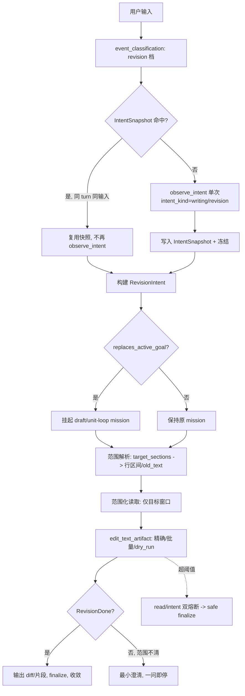

# 长文反复润色：意图快识与精确编辑收敛方案（唯一落地版）

> 本文档给出**唯一一套**可工程落地的方案，不再分阶段、不保留“最小修复”选项。所有改动均对齐当前代码的真实结构与符号；每条改动都标注落点文件、函数与数据流。
>
> 一句话定位：当用户在长文写作中**不断变更意图**时，系统必须**快速、灵活地识别其真实诉求**，并据此对文件做**精确到“某一行 / 某个词 / 某一段”的最小编辑**，编辑完成后**立即收敛**，不回弹、不空转、不重复确认。

---

## 1. 背景与问题定义

### 1.1 真实证据（会话 `b1d631f9-3fc9-4ab6-b854-7843ac14c9fc`，turn 2）

来自 [`debug.log`](debug.log) 的关键时间线：

| 时刻 | 事件 | 问题点 |
|---|---|---|
| 用户输入 | “润色一下你的大纲，我认为写的还不错” | 这是**对既有工件的局部修订**，不是新任务 |
| `event_classification` | `→ new_task` | **误判**：修订被分类为新任务 |
| `planning/input` | `目标: [STEER_REPLAN: 用户中途纠偏…]` | 又被当成纠偏重规划，分类与规划双轨真相不一致 |
| `mode_resolution` | `intent_kind: general`，`target_mode: manuscript_mode` | **意图种类退化为 general**，未稳定识别为 writing/revision |
| `[14s] planning/plan` | `contract: edit_plot`，tools 含 `mission_runtime` | 进入 mission，携带开放式写作能力 |
| `[97s] tool_execution` | `read_text_artifact` + `edit_text_artifact` 均成功 | 编辑本身**成功且质量良好**（见 diff） |
| `[218s] 仍在处理中` | 编辑 97s 完成，但 turn 到 218s 还在跑 | **编辑成功后未收敛**，约 120s 空转 |

结论：**编辑能力没问题，问题全部出在“识别 → 路由 → 收敛”的控制链路**。

### 1.2 用户真实诉求

长文写作用户天然使用这些表达，且会**高频连续**地变更意图：

- 润色这一章 / 不要重写只改对白 / 上一版不错把结尾再收一点
- 保持结构不动只增强情绪 / 把第三章改克制一点 / 第 6 章第二段那句话换个说法

它们的共同本质：**对既有稿件的连续、局部、精确修订**。系统必须把这种“修订”当作一等任务，并能把诉求**直接翻译成最小编辑动作**，而不是每次都重读全文、重新规划、重新扩写。

---

## 2. 现状代码事实基线（落地的前提）

在提出改动前，先锚定当前代码**已经具备**和**尚缺**的能力，避免重复造轮子。

### 2.1 已具备：精确编辑工具（无需新建）

[`handle_edit_text_artifact`](app/services/artifact_tools.py) 已支持完整的精确编辑语义：

- 词/句级：`old_text` / `new_text`，`occurrence_index`（第 N 次出现），`replace_all`
- 行/段级：`start_line` / `end_line` 限定作用域（`_slice_bounds`）
- 容错匹配：`_find_fuzzy_span` 对流式转义、空白、NFKC 归一做模糊定位（阈值 0.82）
- 批量编辑：`edits[]`（`_apply_batch_edits`），一次调用多处修改
- 预演与回显：`dry_run`，`_build_diff_preview`，并通过 [`_emit_edit_diff_stream`](app/services/artifact_tools.py) 推送前端 diff

> **这意味着“精确到某一行 / 某个词 / 某一段”的底层能力已经存在。** 本方案的核心不是重写编辑器，而是**让意图识别的产物能直接、无损地驱动这些参数**，并保证编辑后立刻收敛。

### 2.2 已具备：意图观察与模式路由

- [`IntentObservationResult`](app/domain/intent_observation.py)：字段含 `intent_kind`（qa/engineering/writing/mission_control）、`target_mode`、`session_relation`、`turn_kind_candidate`、`needs_planning`、`confidence`、`source`。
- [`observe_intent`](app/services/intent_observation.py)：L1 结构规则 + L2 可选 LLM；策略由 [`decide_intent_observation_policy`](app/services/intent_observation_policy.py) 决定是否调用 LLM。
- 写作意图载体：[`WritingIntentRecord` / `IntentAnchor`](app/domain/writing_intent_model.py)，`IntentAnchor` 已含 `old_text` / `new_text` / `steer_correction` / `target_hint`。
- `edit_plot` 动作的工具集已在 [`tools_for_command`](app/services/writing/tool_adapter.py) 固定为 `["read_text_artifact", "edit_text_artifact"]`，两阶段 `tool_stages`。

### 2.3 尚缺（本方案要补的真实空白）

| 缺口 | 现状 | 影响 |
|---|---|---|
| 无 `RevisionIntent` 一等结构 | 修订靠 `edit_plot` + `IntentAnchor` 拼装，scope/granularity/preserve/completion 无结构化承载 | 识别结果无法直达编辑参数，模型每次重推 |
| 无单 turn 意图冻结 | 仅有进程级 300s LLM 提示哈希缓存（[`_cache_key`](app/services/llm_client.py)），无 `task_id+turn+input_hash` 快照 | 同一 turn 多次 `observe_intent`、token 空耗 |
| `needs_planning` 双源 | L1 结构规则与 L2 LLM 字段都能产出，[`should_skip_planning_llm`](app/services/pre_planning.py) 消费 | true/false 抖动，门控不稳定 |
| 无范围化读取 | [`handle_read_text_artifact`](app/services/artifact_tools.py) 只有 `max_chars`，无行区间 | 改一段也要读 13KB 全文，慢 |
| 编辑成功后不收敛 | OMAW [`expand_unit_work_loop`](app/services/mission_oma/orchestrator.py) 会在 work_plan 空时继续展开“写下一章” | 改完继续扩写/空转 |
| 漂移检测不感知 mission | [`detect_task_drift`](app/services/task_drift.py) 仅比对前后两条用户文本 | 目标回弹（rebound）检测不到 |
| 分类双轨真相 | `event_classification` 判 `new_task`，规划内又判 `steer_replan` | 修订既非新任务也非纠偏，语义错配 |

---

## 3. 根因分析（对齐代码）

### 3.1 根因一：修订没有被识别为一等意图，被降级为 general / new_task

证据：日志 `intent_kind: general`、`event_classification → new_task`。
代码：[`_STRUCTURAL_KIND_MAP`](app/services/intent_observation.py) 只把 `manuscript/writing` 映射为 `writing`；当 mission 活跃时进一步退化为 `mission_control`；没有“修订（revision）”这一档。修订因此落入 general/mission_control，语义被稀释。

### 3.2 根因二：识别结果与编辑参数之间存在“翻译鸿沟”

`IntentAnchor` 虽有 `old_text/new_text`，但**没有 scope、target_sections、preserve、completion_policy**，也没有一条强制路径把“第 6 章第二段那句话”解析成 `start_line/end_line` 或精确 `old_text`。结果模型只能**重读全文 + 自由发挥**，既慢又易扩写。

### 3.3 根因三：同一 turn 内意图重复确认

无 `IntentSnapshot`，[`planning_node`](app/nodes/planning_node.py) 的重入（路由审计回退、`planning_revision_count`、reflection 重规划）会再次走 `run_pre_planning_pipeline → observe_intent`，可能再打一次 LLM。进程级缓存只按提示哈希命中，不保证同 turn 复用。

### 3.4 根因四：`needs_planning` 双源抖动

[`build_structural_observation`](app/services/intent_observation.py) 用规则算一遍，LLM 又返回一遍，二者可能冲突；下游 [`should_skip_planning_llm`](app/services/pre_planning.py) / [`planning_must_run_llm`](app/services/pre_planning.py) 据此分流，形成 true/false 摆动。

### 3.5 根因五：编辑成功 ≠ 任务完成，mission 继续展开

编辑成功仅置 `TaskStatus.TOOL_EXECUTED` 并 `mark_turn_step_executed`（见 [`writing/executor.py`](app/services/writing/executor.py)、[`tool_node.py`](app/nodes/tool_node.py)）。但 mission 图 `mission_eval → route_after_mission_eval` 默认回到 `mission_decide`；当 `work_plan` 为空，OMAW [`expand_unit_work_loop`](app/services/mission_oma/orchestrator.py) 会materialize“写下一章/复审”，于是“改完还在跑”。

### 3.6 根因六：目标回弹无防护

`mission.objective` 仍是“写整篇/继续剧本”，[`detect_task_drift`](app/services/task_drift.py) 不比对 mission 目标，无法识别“当前规划目标 ≠ 本轮确认的修订目标”的 rebound。

---

## 4. 方案目标与设计原则

### 4.1 目标

1. 修订被识别为**一等意图**，稳定不退化为 general/new_task。
2. 识别产物**直接驱动**精确编辑参数（行/词/段），零二次翻译、零全文重读。
3. 同一 turn 内意图**只识别一次并冻结**；`needs_planning` 由规则唯一派生。
4. 编辑成功后**立即收敛**；draft/unit-loop mission 被挂起，不扩写。
5. 通过 read-loop + intent-loop 双熔断与 mission rebound 检测，杜绝空转与回弹。
6. 全链路可观测：能从日志判定“识别成什么、改了哪里、为什么停/不停”。

### 4.2 设计原则

- **修订优先于延续**：命中既有工件 + 编辑类动词 ⇒ 当前主目标被修订覆盖。
- **最小编辑优先于全文续写**：有明确对象时只读必要片段、只改指定范围、禁止外溢。
- **识别即可执行**：意图识别的输出本身就是一份可直接喂给 `edit_text_artifact` 的编辑指令。
- **改完即停**：默认 `stop_after_edit`，输出 diff/片段，等待下一轮。
- **门控信号规则化**：`needs_planning` 等门控由规则派生，不外包给 LLM。

---

## 5. 唯一方案总览：Revision Fast Path（修订快路）

引入一条贯穿“识别 → 冻结 → 解析为编辑指令 → 范围化读取 → 精确编辑 → 收敛”的专用快路，与既有 draft/mission 路并存，但对“修订类 turn”**强制走快路**。



方案由六个相互咬合的组件构成（第 6–11 节逐一给出工程细节）：

1. **RevisionIntent**：一等修订意图结构，字段与 `edit_text_artifact` 参数一一对应。
2. **IntentSnapshot**：单 turn 意图冻结。
3. **规则派生 needs_planning**：移除 LLM 抖动源。
4. **范围化读取 + 精确编辑桥接**：识别产物直达工具参数。
5. **修订收敛与 mission 挂起**：RevisionDone + suspend，禁止扩写。
6. **回弹/漂移防护 + 可观测**：rebound 检测与审计字段。

---

## 6. 组件一：RevisionIntent —— 识别即编辑指令

### 6.1 数据结构

新增 [`app/domain/revision_intent.py`](app/domain/revision_intent.py)（与 [`writing_intent_model.py`](app/domain/writing_intent_model.py) 并列），作为修订一等结构：

```python
RevisionScope   = Literal["full", "chapter", "section", "paragraph", "sentence", "span"]
OperationType   = Literal["polish", "expand", "compress", "rewrite", "fix", "retone", "restructure"]
OutputMode      = Literal["diff", "fragment", "full"]
CompletionPolicy= Literal["stop_after_edit", "propose_next", "batch_until_done"]

@dataclass
class RevisionEdit:
    """与 handle_edit_text_artifact 参数一一对应，识别层产出后可直接执行。"""
    old_text: str = ""
    new_text: str = ""
    occurrence_index: int | None = None
    start_line: int | None = None
    end_line: int | None = None
    replace_all: bool = False

@dataclass
class RevisionIntent:
    artifact_filename: str                      # -> params.filename
    artifact_role: str = "body"                 # body | outline（对齐 IntentAnchor.target_hint）
    revision_scope: RevisionScope = "span"
    target_sections: list[str] = field(default_factory=list)   # 如 ["第6章 裂痕", "第二段"]
    operation_type: OperationType = "polish"
    edits: list[RevisionEdit] = field(default_factory=list)     # -> params.edits[]
    constraints: list[str] = field(default_factory=list)        # no_expand / no_continue / keep_plot ...
    preserve_requirements: list[str] = field(default_factory=list)
    output_mode: OutputMode = "diff"
    replaces_active_goal: bool = True
    completion_policy: CompletionPolicy = "stop_after_edit"
    source: str = "llm"                          # llm | structural | explicit
    confidence: float = 0.0
```

### 6.2 字段→工具参数映射（零翻译鸿沟）

新增 [`app/services/writing/revision_command.py`](app/services/writing/revision_command.py)，提供 `revision_intent_to_edit_params(ri, task_id)`：

| RevisionIntent 字段 | edit_text_artifact 参数 | 说明 |
|---|---|---|
| `artifact_filename` | `filename` | 经 `_safe_filename` 校验 |
| `edits[i].old_text/new_text` | `old_text/new_text` 或 `edits[]` | 单处用标量，多处用 `edits[]` 批量 |
| `edits[i].occurrence_index` | `occurrence_index` | 词/句多次出现时定位第 N 处 |
| `edits[i].start_line/end_line` | `start_line/end_line` | 段/行级作用域，复用 `_slice_bounds` |
| `edits[i].replace_all` | `replace_all` | 全章统一替换某措辞 |
| `output_mode=diff` | `dry_run`（预演时）/ 结果 `diff_preview` | 已由 `_emit_edit_diff_stream` 回显 |

> **关键收益**：识别层（LLM/规则）一旦产出 `RevisionIntent.edits`，即可**无需再读全文、无需再让模型自由发挥**，直接调用现成的精确编辑器。这正是“快速 + 精确”的工程支点。

### 6.3 识别产出 RevisionIntent 的位置

- 扩展 [`_STRUCTURAL_KIND_MAP`](app/services/intent_observation.py)：新增 `revision` 档，命中“既有工件 + 编辑类动词（润色/改/重写/压缩/换/收/调）”时 `intent_kind="writing"` 且 `revision=True`（在 `IntentObservationResult` 增补 `is_revision: bool` 与 `revision_intent: dict | None`）。
- LLM 观察提示（[`_SYSTEM`](app/services/intent_observation.py)）增加结构化输出契约，要求返回 `revision_scope / target_sections / operation_type / edits / constraints / completion_policy`。当用户已给出可定位线索（“第二段那句话‘…’”）时，LLM 直接产出 `edits[].old_text`；不确定时只产出 `target_sections` 交由 §9 范围解析补齐。
- 在 [`pre_planning.py`](app/services/pre_planning.py) 的 `_EXPLICIT_MODE_MAP` 之外，新增 revision 显式动词短路：命中即跳过规划大模型，走 §8 的薄修订计划。

### 6.4 修订意图优先级规则（强覆盖判定）

在 [`intent_composer.py`](app/services/intent_composer.py) 旁新增 `classify_revision_override(payload, state) -> bool`：

1. 命中既有工件（`manuscript.outline_path/body_path` 或 `list_task_artifacts` 非空）+ 编辑类动词 ⇒ `replaces_active_goal=True`。
2. 出现“不要继续写 / 只改这一段 / 保持结构不动” ⇒ 强制冻结原 mission（`constraints += [no_continue/no_expand/keep_structure]`）。
3. 仅“继续 / 往下写 / 基于这一版往下” ⇒ `replaces_active_goal=False`，恢复 draft/unit-loop。

---

## 7. 组件二：IntentSnapshot —— 单 turn 意图冻结

### 7.1 结构与冻结键

新增 [`app/services/intent_snapshot.py`](app/services/intent_snapshot.py)，落在 state（`AgentStateModel` 已 `extra="allow"`）：

```python
@dataclass
class IntentSnapshot:
    task_id: str
    session_turn: int
    user_input_hash: str        # sha256(normalize(goal))，normalize 复用 _normalize_edit_text 思路
    intent_kind: str
    target_mode: str
    turn_kind_candidate: str | None
    is_revision: bool
    revision_intent: dict | None
    planning_required: bool      # 规则派生（见 §8）
    snapshot_status: str         # "frozen" | "invalidated"
    created_at: str
```

冻结键：`(task_id, session_turn, user_input_hash)`。三者一致即视为“同一轮、同一输入”，意图结果稳定。

### 7.2 冻结/复用契约（改 `observe_intent` 入口）

在 [`observe_intent`](app/services/intent_observation.py) 最前置一层守卫 `get_or_freeze_intent_snapshot(state)`：

- 命中且 `snapshot_status="frozen"` ⇒ 直接返回快照构造的 `IntentObservationResult`，**禁止再调用 LLM**。
- 未命中 ⇒ 执行原 L1+L2 流程，成功后写快照并冻结。
- 失效条件（仅这三种触发重算，写 `intent_recompute_reason`）：
  1. `user_input_hash` 变化（用户输入新内容）；
  2. `session_turn` 递增（新一轮）；
  3. 显式 `invalidate_intent_snapshot(state, reason)`（如确认卡片改写、工具产生新工件副作用）。

> 这从入口消除 §3.3 的同 turn 重复确认，无需依赖 LLM 进程级缓存。

---

## 8. 组件三：`needs_planning` 规则派生（去抖动）

### 8.1 移除 LLM 字段，单一规则来源

- 从 [`_SYSTEM`](app/services/intent_observation.py) 的 LLM 输出契约中**移除 `needs_planning`**（LLM 只判定 `intent_kind / is_revision / target_mode / turn_kind / revision_intent`）。
- 新增 [`app/services/planning_gate_policy.py`](app/services/planning_gate_policy.py)：

```python
def derive_planning_required(state) -> tuple[bool, str]:
    # 返回 (planning_required, source_reason)；source_reason 写入审计
    snap = current_intent_snapshot(state)
    if snap and snap.is_revision and snap.revision_intent:
        # 已能产出可执行 edits 的修订：无需重规划，直接薄修订计划
        if revision_intent_executable(snap.revision_intent):
            return (False, "rule:revision_executable")
        return (True, "rule:revision_needs_scope_resolution")
    if mission_active(state) and not steer_requires_planning(payload, state):
        return (False, "rule:mission_mechanical_step")
    if intent_kind == "qa" and session_relation == "stay":
        return (False, "rule:qa_stay")
    return (True, "rule:default")
```

- [`build_structural_observation`](app/services/intent_observation.py) 与 [`should_skip_planning_llm`](app/services/pre_planning.py) 改为消费 `derive_planning_required`，`planning_required_source` 统一记录为 `rule`（旧 LLM 来源标 `llm_legacy` 仅用于回归对照）。

### 8.2 薄修订计划（跳过规划大模型）

当 `derive_planning_required → (False, "rule:revision_executable")`：在 [`planning_node`](app/nodes/planning_node.py) 的薄路径新增 `revision_thin_plan`：

- 直接产出 `plan = [{"contract": "edit_plot"}]`，`selected_tools = ["read_text_artifact", "edit_text_artifact"]`，`tool_stages = [["read_text_artifact"], ["edit_text_artifact"]]`（复用 [`tool_adapter.py`](app/services/writing/tool_adapter.py)）。
- 把 `RevisionIntent.edits` 注入 `WritingIntentRecord.anchor` 与 turn 载荷，供 §9 命令构建直接消费。
- **不携带** `mission_runtime` 等开放式扩写能力（修复日志中 tools 含 `mission_runtime` 的过宽问题）。

---

## 9. 组件四：范围化读取 + 精确编辑桥接

目标：把“第 6 章第二段那句话”稳定解析成行区间或 `old_text`，并**只读必要窗口**。

### 9.1 为 `read_text_artifact` 增加范围化读取

扩展 [`handle_read_text_artifact`](app/services/artifact_tools.py) 参数：新增可选 `start_line` / `end_line`（缺省维持现状全读+`max_chars`）：

```python
start_line = params.get("start_line"); end_line = params.get("end_line")
if start_line is not None or end_line is not None:
    s, e = _slice_bounds(full_text, _to_int(start_line), _to_int(end_line))  # 复用既有函数
    full_text = full_text[s:e]
```

返回体增加 `scope: {start_line, end_line}`。这样改一段只读一段，直接消除日志中 13KB 全文读取造成的耗时。

### 9.2 章节/段落定位器

新增 [`app/services/writing/section_locator.py`](app/services/writing/section_locator.py)：`resolve_sections(content, target_sections) -> list[(start_line, end_line, anchor_text)]`：

- 章节：按 Markdown 标题（`^#{1,6}\s` 与 `### 第N章` 模式）切分，命中 `第6章 裂痕`。
- 段落：章节内按空行分段，取第 N 段。
- 句子：段内按句末标点（。！？.!?）切分。
- 词/短语：直接产出 `old_text`，由 `edit_text_artifact` 的 `_find_fuzzy_span` 容错定位。

定位优先级：**显式 old_text（用户已给原文）> 行区间 > 章节标题锚点**。任一可定位即可避免全文重读。

### 9.3 命令构建：RevisionIntent → 编辑执行

在 [`command_builder`](app/services/writing/command_builder.py) / [`executor.py`](app/services/writing/executor.py) 的 `edit_plot` 路径接入 `revision_intent_to_edit_params`：

- 若 `RevisionIntent.edits` 已可执行：直接进 [`_execute_edit_plot`](app/services/writing/executor.py)（其内部已是 read+edit 两步），**read 用 §9.1 范围化窗口**，edit 用映射后的精确参数（含 `edits[]` 批量）。
- 若仅有 `target_sections`：先 `resolve_sections` 补齐 `start_line/end_line`，再 `dry_run=True` 预演产出 diff，最后正式写入。
- 多处修订一律走 `edits[]` 批量，单次工具调用完成（[`_apply_batch_edits`](app/services/artifact_tools.py)），避免多轮往返。

---

## 10. 组件五：修订收敛与 mission 挂起（杜绝改完空转）

### 10.1 RevisionDone 判定

新增 [`app/services/revision_done.py`](app/services/revision_done.py)：`is_revision_done(state) -> tuple[bool, str]`，满足全部即判完成：

1. 最近一次 `edit_text_artifact` 成功（`tool_results` 含 `status="ok"` 的 edit，`replacements >= 1`）；
2. 编辑作用域与 `RevisionIntent`（scope/target_sections）对齐（用 `selection.scope` 校验）；
3. 无未执行的显式 `RevisionEdit`（`edits[]` 全部 applied）；
4. `completion_policy != "batch_until_done"` 或批处理队列已空。

### 10.2 收敛落点

- 在 [`turn_guard.py`](app/services/turn_guard.py) 的 `can_finalize_turn` 增加分支：revision turn 且 `is_revision_done` ⇒ 直接放行 finalize（已与 `edit_plot` 的 `_EXECUTION_PRIMARY_OPS` 契约满足一致，见 [`turn_contract.py`](app/services/turn_contract.py)）。
- 在 mission 路：当 `RevisionIntent.completion_policy="stop_after_edit"` 且 `is_revision_done`，让 [`evaluate_mission_control`](app/services/progress_evaluator.py) 返回 `EvalResult(done=True, action="finish", reason="revision_done")`，使 `route_after_mission_eval → finalize`，**不回 `mission_decide`**。

### 10.3 挂起 draft/unit-loop，禁止扩写

当 `RevisionIntent.replaces_active_goal=True`：

- 复用既有挂起机制 [`apply_qa_turn_isolation`](app/services/session/turn_policy.py) 的思路，新增 `apply_revision_turn_isolation`：置 `mission_suspended=True`、`archived_mission=<原 mission>`、`writing_intent.enabled=False`（除修订命令外），`suspension_reason="user_revision_override"`。
- 关键：**阻止 OMAW 展开**。在 [`mechanical_step_decision`](app/services/mission_oma/orchestrator.py) 入口加守卫——若当前 turn 为 revision 且未恢复 draft，则**不调用 `expand_unit_work_loop`**，避免 materialize“写下一章/复审”。
- 恢复条件（写回 [`restore_archived_mission`](app/services/session/turn_policy.py)）：用户明确“继续写后面 / 继续下一章 / 基于这一版往下写”。

### 10.4 双熔断（read-loop + intent-loop）

新增 [`app/runtime/revision_loop_guard.py`](app/runtime/revision_loop_guard.py)，在 [`planning_gate_router.py`](app/runtime/planning_gate_router.py) 与 [`route_after_tool`](app/runtime/router.py) 接入：

- **read-loop**：同一 turn 内 `read_text_artifact` 连续 ≥2 次且其间无新 `edit` ⇒ `revision_loop_guard_triggered=True`，禁止再次回 `incremental_planning`，进 safe finalize。
- **intent-loop**：同一 `(task_id, session_turn)` 内若 `IntentSnapshot` 已 frozen 且 `intent_kind/target_mode/turn_kind` 不变、无新输入/无新工具副作用，则禁止再次 `observe_intent`（与 §7 冻结互为兜底）。
- 阈值集中到 [`config/config.yaml`](config/config.yaml)：`revision.read_loop_max=2`、`revision.intent_recompute_max=1`，与既有 `max_planning_revisions` 同级管理。

---

## 11. 组件六：回弹/漂移防护与可观测性

### 11.1 mission rebound 检测

扩展 [`detect_task_drift`](app/services/task_drift.py)：在原“前后用户文本比对”之外，新增 mission 维度：

```python
confirmed = current_intent_snapshot(state)
planning_goal = mission.objective or payload.goal
if confirmed and confirmed.is_revision and not goals_aligned(confirmed, planning_goal):
    return {"drifted": True, "drift_type": "mission_rebound",
            "confirmed_goal": confirmed.revision_summary,
            "current_planning_goal": planning_goal}
```

出现 `mission_rebound` ⇒ 在 [`planning_node`](app/nodes/planning_node.py) 优先回退到 confirmed revision goal（覆盖 `mission.objective` 的临时使用），不让“写整篇剧本”抬头。

### 11.2 分类双轨真相修复

修订 turn 不应被 `event_classification` 判为 `new_task`。对齐 [`docs/arch.md`](docs/arch.md) §2.8“分类只算一次”：在事件分类阶段引入 revision 语义——有活跃写作工件 + 编辑类动词 ⇒ 事件类型 `revision`（归入“补充/纠偏”同族），入口与图内首节点读同一份分类结果，禁止 `new_task` 与 `steer_replan` 并存的双轨。

### 11.3 审计字段与事件

在 turn 审计中新增（供日志直接判读）：

- 字段：`intent_snapshot_hit`、`intent_snapshot_source`、`planning_required_source`（`rule`/`llm_legacy`）、`is_revision`、`revision_scope`、`target_sections`、`active_goal_source`（`revision_override`/`mission`）、`draft_mission_state`（`suspended`/`active`）、`revision_done`、`revision_loop_guard_triggered`、`intent_recompute_reason`。
- 事件：`revision_intent_recognized`、`active_goal_replaced`、`draft_mission_suspended`、`scoped_read`、`scoped_edit_completed`、`revision_done`、`revision_loop_guard_triggered`、`mission_rebound_detected`。

### 11.4 产品层修订确认（轻量、非阻塞）

复用既有 diff 流（[`_emit_edit_diff_stream`](app/services/artifact_tools.py) / [`writing_delta`](app/services/confirmation/writing_delta.py)）：进入修订快路时，前端展示一段边界说明（当前工件 / 修改范围 / 修改动作 / 保护边界 / 输出方式）。仅当 `RevisionIntent` 范围解析置信度低时触发**一问即停**的最小澄清，不进入长时间规划。

---

## 12. 落地实现清单（单一交付，按依赖排序）

> 以下为**同一套方案的必需改动**，按依赖顺序实现，不分“最小/可选”。

| # | 落点文件 | 改动 | 依赖 |
|---|---|---|---|
| 1 | 新增 [`app/domain/revision_intent.py`](app/domain/revision_intent.py) | `RevisionIntent` / `RevisionEdit` 结构 | — |
| 2 | 新增 [`app/services/writing/revision_command.py`](app/services/writing/revision_command.py) | `revision_intent_to_edit_params` 字段→参数映射 | 1 |
| 3 | 改 [`app/services/artifact_tools.py`](app/services/artifact_tools.py) | `read_text_artifact` 增 `start_line/end_line`（复用 `_slice_bounds`） | — |
| 4 | 新增 [`app/services/writing/section_locator.py`](app/services/writing/section_locator.py) | 章/段/句/词定位 → 行区间或 `old_text` | 3 |
| 5 | 新增 [`app/services/intent_snapshot.py`](app/services/intent_snapshot.py) | 单 turn 冻结/复用/失效 | — |
| 6 | 改 [`app/services/intent_observation.py`](app/services/intent_observation.py) | 入口接 snapshot 守卫；`_STRUCTURAL_KIND_MAP` 增 revision；`IntentObservationResult` 增 `is_revision/revision_intent`；`_SYSTEM` 输出契约去 `needs_planning`、增修订字段 | 1,5 |
| 7 | 新增 [`app/services/planning_gate_policy.py`](app/services/planning_gate_policy.py) | `derive_planning_required` 规则派生 | 5,6 |
| 8 | 改 [`app/services/pre_planning.py`](app/services/pre_planning.py) | `should_skip_planning_llm` 消费规则派生；新增 revision 显式短路 | 7 |
| 9 | 改 [`app/nodes/planning_node.py`](app/nodes/planning_node.py) | 新增 `revision_thin_plan`；mission rebound 回退；不带 `mission_runtime` | 2,7 |
| 10 | 改 [`app/services/intent_composer.py`](app/services/intent_composer.py) | `classify_revision_override`（强覆盖判定） | 6 |
| 11 | 改 [`app/services/writing/executor.py`](app/services/writing/executor.py) / [`command_builder.py`](app/services/writing/command_builder.py) | `edit_plot` 接入范围化 read + 精确/批量 edit | 2,3,4 |
| 12 | 新增 [`app/services/revision_done.py`](app/services/revision_done.py) | `is_revision_done` 完成判定 | 1 |
| 13 | 改 [`app/services/turn_guard.py`](app/services/turn_guard.py) / [`app/services/progress_evaluator.py`](app/services/progress_evaluator.py) | revision_done ⇒ finalize / `EvalResult(done)` | 12 |
| 14 | 改 [`app/services/session/turn_policy.py`](app/services/session/turn_policy.py) / [`app/services/mission_oma/orchestrator.py`](app/services/mission_oma/orchestrator.py) | `apply_revision_turn_isolation`；OMAW 守卫禁止 `expand_unit_work_loop` | 10 |
| 15 | 新增 [`app/runtime/revision_loop_guard.py`](app/runtime/revision_loop_guard.py) + 接入 [`planning_gate_router.py`](app/runtime/planning_gate_router.py) / [`router.py`](app/runtime/router.py) | read-loop + intent-loop 双熔断 | 5,12 |
| 16 | 改 [`app/services/task_drift.py`](app/services/task_drift.py) | mission_rebound 检测 | 5 |
| 17 | 改事件分类 + 审计 | revision 事件档；§11.3 审计字段/事件 | 6 |
| 18 | 改 [`config/config.yaml`](config/config.yaml) | `revision.read_loop_max` / `intent_recompute_max` / 显式动词表 | 15 |

---

## 13. 验收判据

方案生效的硬指标（全部稳定通过）：

1. “润色这一章，不要改后面”：只改该章并立即收尾，OMAW **不** materialize 下一章写作项。
2. “保持剧情不变，把对白写得更克制”：仅 retone，`constraints` 含 `keep_plot/no_expand`，无剧情扩写。
3. “上一版不错，把结尾再收一点”：基于最近修订上下文继续微调，不重推整篇。
4. “第 6 章第二段那句话‘…’换个说法”：`section_locator` 解析到行区间/old_text，**只读该段**，单次 `edit_text_artifact` 完成。
5. 一次 edit 成功后，日志**不再**出现 repeated planning / repeated read；turn 在 edit 完成后迅速 finalize（消除 97s→218s 空转）。
6. 同一 `session_turn` 内 `intent_observation` LLM 调用 ≤1 次（`intent_snapshot_hit=true` 可复用）。
7. 日志可见 `active_goal_source=revision_override`、`draft_mission_state=suspended`、`planning_required_source=rule`、`revision_done=true`。
8. 误判修订为 `new_task` 的双轨真相消失（事件分类与规划内分类一致为 revision）。

---

## 14. 结论

本方案的核心判断：**精确编辑的底层能力（`edit_text_artifact`）已经完备**，长文反复润色的真正瓶颈在“识别 → 路由 → 收敛”的控制链路。因此唯一可落地的解法是把“修订”提升为一等任务类型，并打通一条 **Revision Fast Path**：

1. **识别即编辑指令**——`RevisionIntent` 字段与编辑器参数一一对应，识别产物可直接执行，实现“快速 + 精确（行/词/段）”。
2. **单 turn 意图冻结 + `needs_planning` 规则派生**——消除重复确认与门控抖动。
3. **范围化读取 + 精确/批量编辑**——只读必要窗口，单次完成多处修改。
4. **RevisionDone + mission 挂起 + 双熔断**——编辑成功立即收敛，禁止扩写与回弹。
5. **rebound 检测 + 全链路审计**——目标不抬头，问题可从日志直接判读。

落实第 12 节清单后，系统将稳定呈现用户期望的行为：**它确实理解我现在要改哪里、改到什么程度、改完就停**，同时显著压降同一 turn 内的无意义 token 消耗与时延。
